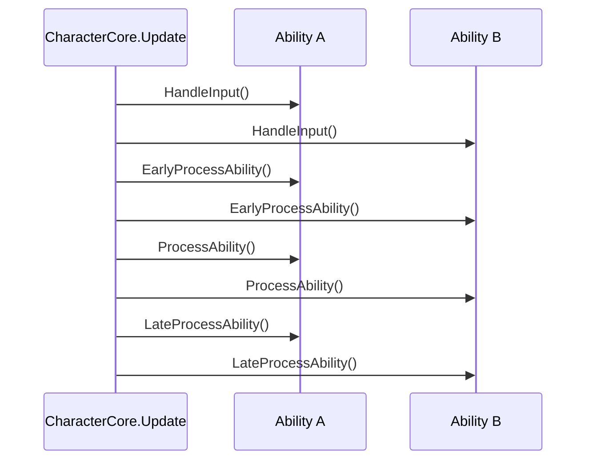

# Custom abilities

Every mechanic on a Gameplay Kit character, from walking to wall-jumping to attacking, is an ability: a
component derived from `AbilityBase` that `CharacterCore` runs every frame. Writing your own uses exactly the
same contract the built-in abilities use. This guide explains how that contract works, then builds a new
ability from scratch.

## How CharacterCore runs abilities

### Discovery

In `Awake`, [CharacterCore](../components/core/CharacterCore.md):

1. Creates two state machines, `Movement` (a `MovementState`, starting at `Idle`) and `Condition` (a
   `ConditionState`, starting at `Normal`), and grabs the `CharacterController2D`.
2. Adds a `KeyboardInputReader` if no component on the GameObject implements `ICharacterInput`.
3. Collects every `AbilityBase` on the GameObject **and its children**, inactive ones included, and calls
   `Initialize(this)` on each one.

Discovery happens only once. In a scene, all components exist before any `Awake` runs, so order doesn't
matter. When you build a character from code, add `CharacterCore` **last** (or build the GameObject
inactive and activate it at the end). An ability added after the core has woken up is never run.

### The frame

Each `Update`, unless the condition is `Paused` or the abilities are suspended, the core runs **four phases**,
and each phase goes through *all* abilities before the next one starts:



| Phase | Use it for | Example in the kit |
|---|---|---|
| `HandleInput` | Reading raw input into fields. | — |
| `EarlyProcessAbility` | Detecting conditions, or claiming something before other abilities act on it. | `PlayerJump` records when it was last grounded. `PlayerDropThrough` blocks the jump for this frame. |
| `ProcessAbility` | The main logic: changing velocity and state. | Almost every movement ability. |
| `LateProcessAbility` | Final adjustments after everyone has moved. | — |

Because the phases are global, an ability can affect another one regardless of component order. For
example, `PlayerDropThrough` calls `BlockJumpThisFrame()` in *Early*, and `PlayerJump` checks
`IsJumpBlocked` in *Process*, so down + jump on a one-way platform drops instead of jumping.

**Within** a phase, abilities run in the order `GetComponentsInChildren` returns them, which is the order of
the components in the Inspector (the object's own first, then its children). That order matters when two
abilities write the same value in the same phase: the later one wins. This is why `PlayerCrouch` (which
scales down the horizontal speed) should sit **below** `PlayerWalkRun`.

### Enabling, suspending and fault isolation

- **`AbilityEnabled`** and the component's Inspector checkbox (`enabled`) are both checked: an ability with
  `AbilityEnabled = false`, or whose component is unticked, is skipped in every phase. Untick it in the
  Inspector while testing, or toggle either one from code. Unticking also calls your `OnDisable`, so release
  gravity overrides and locks there.
- **`Suspend(source)` / `Resume(source)`** pause *all* abilities on behalf of a source object without touching
  their `AbilityEnabled`. Several sources can suspend at once, and abilities come back when every source has
  resumed. `CharacterKnockback` suspends for a short lockout, `CharacterStun` for the stun, and
  `CharacterDeath` until the character respawns. `AbilitiesSuspended` tells you whether anything is
  holding them.
- **Fault isolation**: if an ability throws an exception in any phase, the core sets its `AbilityEnabled` to
  false, logs `[GameplayKit] <Ability> on '<object>' threw an exception and was disabled` (in Spanish in the
  current build) with the exception, and keeps running the others. One broken ability doesn't freeze the
  character or spam the console every frame.
- **`ResetCharacter()`**, called by `CharacterRespawn`, clears all suspensions, sets `Movement` to `Idle` and
  `Condition` to `Normal`, and calls `ResetAbility()` on every ability.

## What AbilityBase gives you

| Member | What it is |
|---|---|
| `protected CharacterCore Character` | The core. Through it: `Controller`, `Movement`, `Condition`, `Suspend`/`Resume`. |
| `protected ICharacterInput CharacterInput` | The input source found on the character at initialisation. |
| `bool AbilityEnabled { get; set; }` | Whether the core runs this ability (default `true`). The core also skips it while the component is disabled. |
| `virtual void Initialize(CharacterCore character)` | Called once by the core. Override it to cache components, and **always call `base.Initialize(character)` first**, since that sets `Character` and `CharacterInput`. |
| `virtual void HandleInput()` | Phase 1. |
| `virtual void EarlyProcessAbility()` | Phase 2. |
| `virtual void ProcessAbility()` | Phase 3. |
| `virtual void LateProcessAbility()` | Phase 4. |
| `virtual void ResetAbility()` | Called when the character respawns or is reset. Undo any temporary state here (gravity overrides, flags, timers). |

`Initialize` can run before your ability's own `Awake`, because the core's `Awake` calls it. Do your setup in
`Initialize`, not in `Awake`.

## What CharacterController2D gives you

Abilities should move the character through [CharacterController2D](../components/core/CharacterController2D.md)
rather than touching the `Rigidbody2D` directly:

| Member | Use |
|---|---|
| `IsGrounded` | Ground check, refreshed every physics step from a small circle under the collider (or **Ground Check**). |
| `Velocity`, `Move(Vector2)`, `SetVerticalVelocity(float)` | Read and write the body's velocity. |
| `Rigidbody` | The underlying `Rigidbody2D`, when you really need it. |
| `OverrideGravity(owner, scale)` / `ReleaseGravity(owner)` / `IsGravityOverridden` | Shared gravity, see below. |
| `DefaultGravityScale`, `GravityMultiplier` | Base gravity (the body's original **Gravity Scale**) and a multiplier, used by `CharacterGravityController` for faster falls. |
| `LockHorizontalControl(seconds)` / `IsHorizontalControlLocked` | Tell the base movement to keep its hands off the horizontal velocity for a while. |
| `BlockJumpThisFrame()` / `IsJumpBlocked` | Claim this frame's jump press so the jump abilities ignore it. |

### Sharing gravity

Many abilities need to switch gravity off for a while: ladders, swimming, flying, ledges, ziplines, ropes,
slopes, path following, top-down movement. If each one wrote `gravityScale` directly, one releasing it would
break another that still needs it. Instead:

- `OverrideGravity(this, scale)` registers (or updates) your override, and the **most recent** override is
  the one applied.
- `ReleaseGravity(this)` removes only *your* override. When none are left, gravity goes back to
  `DefaultGravityScale × GravityMultiplier`.

The rule for your own abilities: every `OverrideGravity` needs a matching `ReleaseGravity`, when the
ability ends, in `ResetAbility`, and when the component is disabled.

### Locking horizontal control

`PlayerWalkRun` writes the horizontal velocity from input every frame, which would cancel any push you apply.
Call `LockHorizontalControl(seconds)` when your ability takes over the horizontal velocity
(`PlayerWallJump` does it for the kick, `PlayerRollDodge` for the roll). Locks only ever extend, never
shorten. If your ability is itself a "base" mover, respect `IsHorizontalControlLocked` the same way
`PlayerWalkRun` does.

## Step by step: a hover ability

Let's build `PlayerHover`: press an action in mid-air and the character floats in place for up to 1.5 seconds,
able to drift sideways slowly. It recharges on landing.

### 1. Create the class

Create `PlayerHover.cs`. The file name must match the class name, or Unity shows *Missing Script* when you save.

```csharp
using System;
using GameplayKit.Core;
using UnityEngine;

public class PlayerHover : AbilityBase
{
    [Tooltip("Action that starts hovering. Its key is bound in KeyboardInputReader (Special = K by default).")]
    [SerializeField] private CharacterAction hoverAction = CharacterAction.Special;
    [SerializeField] private float maxHoverTime = 1.5f;
    [SerializeField] private float driftSpeed = 3f;

    public bool IsHovering { get; private set; }
    public float HoverTimeLeft { get; private set; }
    public event Action<bool> OnHoverChanged;

    private bool _wantsHover;
}
```

### 2. Initialise

Fill the tank when the core hands you the character:

```csharp
    public override void Initialize(CharacterCore character)
    {
        base.Initialize(character);   // sets Character and CharacterInput
        HoverTimeLeft = maxHoverTime;
    }
```

### 3. Read input

Only a press in the air starts a hover, and releasing the action ends it:

```csharp
    public override void HandleInput()
    {
        if (CharacterInput.GetActionDown(hoverAction) && !Character.Controller.IsGrounded) _wantsHover = true;
        if (!CharacterInput.GetAction(hoverAction)) _wantsHover = false;
    }
```

### 4. Detect landing early

Recharge and stop hovering as soon as the character is grounded, before anyone processes this frame:

```csharp
    public override void EarlyProcessAbility()
    {
        if (!Character.Controller.IsGrounded) return;
        HoverTimeLeft = maxHoverTime;
        if (IsHovering) StopHover();
    }
```

### 5. The main logic

Start, keep or stop the hover, and move the character while it lasts:

```csharp
    public override void ProcessAbility()
    {
        bool canHover = Character.Condition.CurrentState == ConditionState.Normal
                        && !Character.Controller.IsGrounded
                        && HoverTimeLeft > 0f;

        if (_wantsHover && canHover && !IsHovering) StartHover();
        else if (IsHovering && (!_wantsHover || !canHover)) StopHover();

        if (!IsHovering) return;

        HoverTimeLeft -= Time.deltaTime;
        Character.Controller.Move(new Vector2(CharacterInput.MoveInput.x * driftSpeed, 0f));
    }
```

`PlayerWalkRun` also writes the horizontal velocity in `ProcessAbility`, and it keeps the vertical velocity
(0 while hovering), so the two cooperate. Whichever comes later in the Inspector sets the horizontal speed.
If you want the hover's drift speed to always win, move the `Move` call to `LateProcessAbility`.

### 6. Share gravity properly

```csharp
    private void StartHover()
    {
        IsHovering = true;
        Character.Controller.OverrideGravity(this, 0f);
        Character.Controller.SetVerticalVelocity(0f);
        OnHoverChanged?.Invoke(true);
    }

    private void StopHover()
    {
        IsHovering = false;
        _wantsHover = false;
        Character.Controller.ReleaseGravity(this);
        OnHoverChanged?.Invoke(false);
    }
```

### 7. Clean up on reset and disable

When the character dies mid-hover, `CharacterDeath` suspends the abilities, so `ProcessAbility` stops
running and can't release the gravity. `CharacterRespawn` then calls `ResetCharacter`, which reaches your
`ResetAbility`:

```csharp
    public override void ResetAbility()
    {
        if (IsHovering) StopHover();
        HoverTimeLeft = maxHoverTime;
        _wantsHover = false;
    }

    private void OnDisable()
    {
        if (IsHovering) StopHover();
    }
```

### 8. Add it to the character

Add `PlayerHover` to your player next to the other abilities. *Create Player* already has a `CharacterCore`,
and in a scene the core discovers abilities when the level loads. Press Play, jump, and hold **K**.

!!! tip "Pick a free action"
    `PlayerAttack` uses **Special** to switch weapons when a `WeaponInventorySlot` is present, and `PlayerFly`
    uses **Fly**. Choose a different **Hover Action**, or rebind keys in `KeyboardInputReader`'s **Action
    Bindings**.

??? example "The complete PlayerHover.cs"
    ```csharp
    using System;
    using GameplayKit.Core;
    using UnityEngine;

    public class PlayerHover : AbilityBase
    {
        [Tooltip("Action that starts hovering. Its key is bound in KeyboardInputReader (Special = K by default).")]
        [SerializeField] private CharacterAction hoverAction = CharacterAction.Special;
        [SerializeField] private float maxHoverTime = 1.5f;
        [SerializeField] private float driftSpeed = 3f;

        public bool IsHovering { get; private set; }
        public float HoverTimeLeft { get; private set; }
        public event Action<bool> OnHoverChanged;

        private bool _wantsHover;

        public override void Initialize(CharacterCore character)
        {
            base.Initialize(character);
            HoverTimeLeft = maxHoverTime;
        }

        public override void HandleInput()
        {
            if (CharacterInput.GetActionDown(hoverAction) && !Character.Controller.IsGrounded) _wantsHover = true;
            if (!CharacterInput.GetAction(hoverAction)) _wantsHover = false;
        }

        public override void EarlyProcessAbility()
        {
            if (!Character.Controller.IsGrounded) return;
            HoverTimeLeft = maxHoverTime;
            if (IsHovering) StopHover();
        }

        public override void ProcessAbility()
        {
            bool canHover = Character.Condition.CurrentState == ConditionState.Normal
                            && !Character.Controller.IsGrounded
                            && HoverTimeLeft > 0f;

            if (_wantsHover && canHover && !IsHovering) StartHover();
            else if (IsHovering && (!_wantsHover || !canHover)) StopHover();

            if (!IsHovering) return;

            HoverTimeLeft -= Time.deltaTime;
            Character.Controller.Move(new Vector2(CharacterInput.MoveInput.x * driftSpeed, 0f));
        }

        public override void ResetAbility()
        {
            if (IsHovering) StopHover();
            HoverTimeLeft = maxHoverTime;
            _wantsHover = false;
        }

        private void StartHover()
        {
            IsHovering = true;
            Character.Controller.OverrideGravity(this, 0f);
            Character.Controller.SetVerticalVelocity(0f);
            OnHoverChanged?.Invoke(true);
        }

        private void StopHover()
        {
            IsHovering = false;
            _wantsHover = false;
            Character.Controller.ReleaseGravity(this);
            OnHoverChanged?.Invoke(false);
        }

        private void OnDisable()
        {
            if (IsHovering) StopHover();
        }
    }
    ```

### 9. Test it

The kit's test helpers work for your abilities too (see [Testing](../reference/testing.md)). In a play-mode
test assembly that references `GameplayKit.Runtime` and `GameplayKit.Tests.Runtime`:

```csharp
using System.Collections;
using GameplayKit.Core;
using GameplayKit.Movement;
using GameplayKit.Tests;
using NUnit.Framework;
using UnityEngine;
using UnityEngine.TestTools;

public class PlayerHoverTests
{
    private TestWorld _world;

    [SetUp] public void SetUp() => _world = new TestWorld();
    [TearDown] public void TearDown() => _world.Dispose();

    [UnityTest]
    public IEnumerator Hover_HoldsHeight_ThenFallsWhenTimeRunsOut()
    {
        _world.Ground();
        var player = _world.Player(new Vector2(0f, 0.5f), out var input, typeof(PlayerJump), typeof(PlayerHover));
        while (!player.Controller.IsGrounded) yield return null;

        input.Jump = true;
        yield return new WaitForSeconds(0.3f);
        input.Jump = false;
        input.Hold(CharacterAction.Special);
        yield return new WaitForSeconds(0.2f);

        float y = player.transform.position.y;
        yield return new WaitForSeconds(0.5f);
        Assert.AreEqual(y, player.transform.position.y, 0.05f, "Hovering keeps the height");

        yield return new WaitForSeconds(1.5f);
        Assert.Less(player.transform.position.y, y - 0.5f, "Falls once the hover time is used up");
        input.Release(CharacterAction.Special);
    }
}
```

## Checklist for your own abilities

- Derive from `AbilityBase`, one class per file with a matching name.
- Override `Initialize` for setup, and call `base.Initialize(character)` first.
- Read input through `CharacterInput`, never `UnityEngine.Input`. Then it works with AI, replays and tests.
- Move through `Character.Controller`. Pair every `OverrideGravity` with a `ReleaseGravity`.
- Lock horizontal control when you own the horizontal velocity.
- Respect `Character.Condition` (`Stunned`, `Dead`) if your ability could run while it shouldn't.
- Undo temporary state in `ResetAbility`.
- To turn an ability off at runtime, set `AbilityEnabled = false` or disable the component (`enabled = false`).
