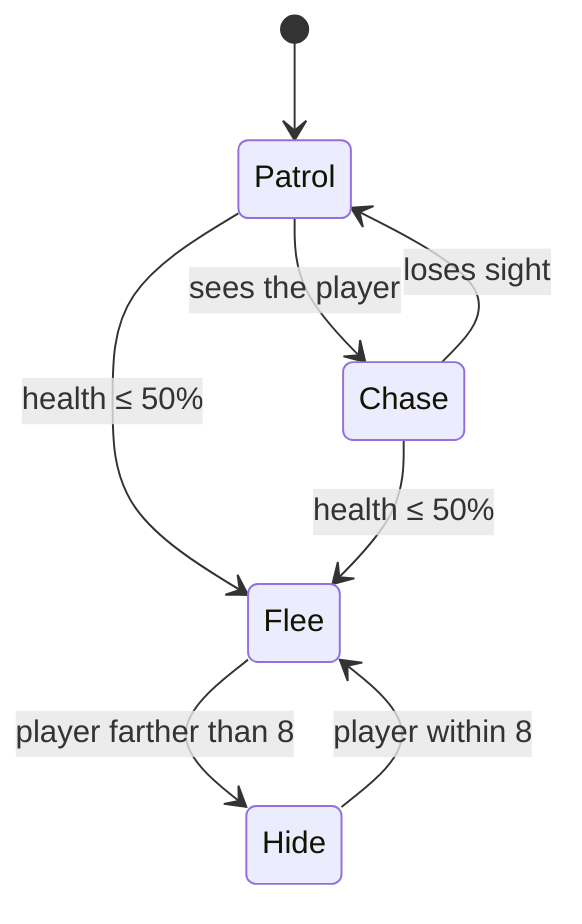

# Enemies and AI

Gameplay Kit gives you two ways to make an enemy think:

- **Standalone behaviours** (`EnemyPatrol`, `EnemyChase`, `EnemyFlee`, `EnemyShootOnSight`...). One component
  does one job, all the time. Drop it on and you're done.
- **`AIBrain`**, a state machine you assemble in the Inspector from small **actions** (what the enemy does) and
  **decisions** (when it changes its mind). Use it when an enemy needs to switch between behaviours, like
  patrolling until it sees you, then chasing.

Both live in the `GameplayKit.AI` namespace and work with the same enemy body.

## The enemy body

An enemy is just a GameObject with a `Collider2D` and a `Rigidbody2D`. Every mover sets the body's horizontal
velocity and lets gravity handle the vertical part. **GameplayKit → Create Enemy** builds a complete one:

| Component | Why it's there |
|---|---|
| `BoxCollider2D` (0.9 × 0.9) + `Rigidbody2D` with **Freeze Rotation** | The physical body. |
| [EnemyPatrol](../components/ai/EnemyPatrol.md) | Walks and turns around at walls and ledges. |
| [EnemyMeleeOnContact](../components/ai/EnemyMeleeOnContact.md) | Hurts the player on touch: 10 damage, at most once per second, only to objects tagged `Player`. |
| [DamageableObject](../components/combat/DamageableObject.md) | 20 HP. It is destroyed when health reaches zero. Weapons hit it through `IDamageable`. |
| [DamageFlash](../components/health/DamageFlash.md) and [DamagePopupSpawner](../components/ui/DamagePopupSpawner.md) | Tint and floating numbers when it gets hit. |

The object is named "Enemy" and has no tag. Nothing in the kit needs enemies to be tagged. If an enemy needs
invulnerability frames, knockback or a death animation, use [CharacterHealth](../components/health/CharacterHealth.md)
instead of `DamageableObject`. Both implement `IHealthSource`, so the AI decisions and the feedback
components work with either.

## Standalone behaviours

<figure class="gk-clip" markdown="0"><video src="../../assets/clips/EnemyPatrol.mp4" poster="../../assets/clips/EnemyPatrol.jpg" autoplay loop muted playsinline preload="metadata"></video><figcaption>EnemyPatrol turns around at walls and at the edge of its platform with no setup.</figcaption></figure>

| Component | What it does | Needs a target? |
|---|---|---|
| [EnemyPatrol](../components/ai/EnemyPatrol.md) | Walks in a straight line at **Speed** 2 and turns at walls and ledges. Without **Wall Check**/**Edge Check** it casts from the edges of its own collider. | No |
| [EnemyPatrolWithinBounds](../components/ai/EnemyPatrolWithinBounds.md) | Walks back and forth between a left and a right X position. The bounds can be children: their positions are read once at start. It doesn't check walls or ledges. | No |
| [EnemyChase](../components/ai/EnemyChase.md) | Moves horizontally towards the target while it's within **Detection Range** (8) and stops at **Stopping Distance** (0.5). Flips to face it. | Yes (empty = `Player` tag) |
| [EnemyFlee](../components/ai/EnemyFlee.md) | Runs away from the target while it's within **Flee Range** (6), facing the way it runs. | Yes (empty = `Player` tag) |
| [EnemyShootOnSight](../components/ai/EnemyShootOnSight.md) | Fires the `WeaponHitscan` or `WeaponProjectile` on the same object when the target is inside a cone (**Sight Range** 10, **Sight Angle** 60) with nothing in between. It doesn't move. | Yes (empty = `Player` tag) |
| [EnemyMeleeOnContact](../components/ai/EnemyMeleeOnContact.md) | Damages any `IDamageable` it touches, through a collision or a trigger, filtered by **Target Tag**. | Tag only |
| [EnemyPathfindingAgent](../components/ai/EnemyPathfindingAgent.md) | *Experimental.* Drives a `NavMeshAgent` towards the target. It needs a NavMesh on the XY plane (for example from NavMeshPlus) and does nothing without one. | Yes |

Combinations that work well:

- **Patrol + contact damage**: the classic platformer enemy, exactly what *Create Enemy* builds.
- **Patrol + shoot on sight**: `EnemyPatrol`, `EnemyShootOnSight` and a `WeaponProjectile` (or
  `WeaponHitscan`). The sight cone uses the facing direction (the sign of `localScale.x`), which `EnemyPatrol`
  flips, so the enemy only shoots at what's in front of it.
- **Chase + contact damage**: a pursuer that hurts on touch.

!!! warning "Don't stack two movers"
    `EnemyPatrol`, `EnemyPatrolWithinBounds`, `EnemyChase` and `EnemyFlee` each write the Rigidbody2D velocity
    every frame. Put two on the same enemy and whichever updates last wins. To switch between patrolling and
    chasing, use an `AIBrain`.

`EnemyChase`, `EnemyFlee` and `EnemyShootOnSight` use the **Target** you assign in the Inspector, and when it's
empty they find the GameObject tagged `Player` by themselves (through `PlayerLocator`, at most every half
second). So prefabs spawned at runtime work as long as your player has the tag. Each one also exposes a public
`Target` property to change it from code, and `EnemySpawner` fills it for spawned enemies.

## AIBrain: states, actions and decisions

<figure class="gk-clip" markdown="0"><video src="../../assets/clips/AIBrain.mp4" poster="../../assets/clips/AIBrain.jpg" autoplay loop muted playsinline preload="metadata"></video><figcaption>An AIBrain switching states as the player gets close and moves away.</figcaption></figure>

[AIBrain](../components/ai/AIBrain.md) holds a list of **States**. Each state has:

- **Name**: the string transitions use to point at it (case-sensitive).
- **Actions**: components derived from `AIActionBase`. Every frame the state is active, each action's
  `PerformAction(brain)` runs, in list order.
- **Transitions**: each one has a **Decision** (a component derived from `AIDecisionBase`), a **True Target
  State** and a **False Target State**. An empty target means "stay here".

Each frame, the brain first runs the current state's actions, then checks its transitions from top to bottom.
For each transition it calls `Decide(brain)` and picks the true or false target. The first transition that
points at a *different* state wins: the brain calls `OnExitState` on the old state's actions, switches,
calls `OnEnterState` on the new state's actions, and skips the remaining transitions. That makes the order of
the transitions list your priority order.

At start the brain enters **Initial State**, or the first state in the list if that's empty. With no states
it does nothing. If a transition points at a name that doesn't exist, it logs a warning and stays where it is.

Actions and decisions are ordinary components, usually on the enemy itself. They have no `Update` of their
own and only run when a state references them, so a spare one sitting on the object is harmless. Untick one
in the Inspector and the brain skips it: a disabled action doesn't run its `PerformAction`, and a transition
whose decision is disabled is ignored. The same decision component can be used by several transitions in
different states.

### The target

Every built-in action and decision reads `brain.Target`, usually the player. There are three ways to set it:

1. Drag it into the **Target** field in the Inspector.
2. Let an [EnemySpawner](#spawning-enemies) assign it. It does so when the spawned brain has no target,
   using the spawner's own **Target** or, when that's empty, the object tagged `Player`.
3. Set it from code: `brain.Target = player.transform;`

With no target, the built-in actions do nothing and the target-based decisions return false.

### Built-in actions

| Action | Does |
|---|---|
| [AIActionPatrolPoints](../components/ai/AIActionPatrolPoints.md) | Walks between **Waypoints**, comparing only X, so a point slightly above or below the floor is still reached. With **Loop** off it stops at the last point and sets `Finished`. It flips to face where it walks. |
| [AIActionMoveToTarget](../components/ai/AIActionMoveToTarget.md) | Moves horizontally towards the target at **Speed** 3 and stops within **Stopping Distance** (0.3). It doesn't flip the enemy. |
| [AIActionFlee](../components/ai/AIActionFlee.md) | Moves horizontally away from the target at **Speed** 3.5. It doesn't flip the enemy. |
| [AIActionShoot](../components/ai/AIActionShoot.md) | Fires the `WeaponHitscan` or `WeaponProjectile` on the same object towards the target, every **Fire Interval** (1 s). The first shot comes right after entering the state. |
| [AIActionWait](../components/ai/AIActionWait.md) | Nothing. Use it for idle or "hide" states, usually with a time-based decision. |

The moving actions zero the horizontal velocity in `OnExitState`, so an enemy doesn't drift when it changes
state.

### Built-in decisions

| Decision | True when |
|---|---|
| [AIDecisionTargetInRange](../components/ai/AIDecisionTargetInRange.md) | The target is within **Range** (6) units, in any direction. |
| [AIDecisionLineOfSight](../components/ai/AIDecisionLineOfSight.md) | The target is within **Max Distance** (10) and a ray to it hits nothing in **Obstacle Layers**. The ray ignores the enemy and the target, so *Everything* works. It sees in every direction, not only forwards. |
| [AIDecisionHealthThreshold](../components/ai/AIDecisionHealthThreshold.md) | The enemy's health ratio is at or below **Threshold Ratio 01** (0.5). It reads any `IHealthSource` on the object or its parents. |
| [AIDecisionTimeInState](../components/ai/AIDecisionTimeInState.md) | The brain has been in the current state for at least **Seconds** (2). |

## Worked example: patrol, chase on sight, flee when hurt

Here's an enemy that patrols its platform, chases the player as soon as it has a clear line of sight, goes
back to patrolling when it loses sight, and runs away once it drops to half health. Once it's far enough
away, it waits until the player comes close again.



### 1. Build the body

1. Use **GameplayKit → Create Enemy** and place it on a platform.
2. **Remove `EnemyPatrol`.** It would fight the brain's actions for the velocity. Keep
   `EnemyMeleeOnContact`, `DamageableObject` (raise **Max Health** to 40 so the flee state is easy to see),
   `DamageFlash` and `DamagePopupSpawner`.
3. Add two empty children, `PointA` and `PointB`, near the ends of the platform. Their positions are read
   once when the enemy starts, so it's fine that they move with it.

### 2. Add the pieces

Add these components to the enemy:

- **Actions**: `AIActionPatrolPoints` (set **Waypoints** to `PointA` and `PointB`), `AIActionMoveToTarget`,
  `AIActionFlee` and `AIActionWait`.
- **Decisions**: `AIDecisionHealthThreshold` (leave **Threshold Ratio 01** at 0.5), `AIDecisionLineOfSight`
  and `AIDecisionTargetInRange` (set **Range** to 8).
- **`AIBrain`**: drag the player into **Target** and type `Patrol` in **Initial State** (or leave it empty, since
  Patrol is first).

### 3. Fill in the states

Drag the components from the same GameObject into each list:

| State | Actions | Transitions (Decision → True Target State / False Target State) |
|---|---|---|
| `Patrol` | `AIActionPatrolPoints` | 1. `AIDecisionHealthThreshold` → `Flee` / *(empty)*<br>2. `AIDecisionLineOfSight` → `Chase` / *(empty)* |
| `Chase` | `AIActionMoveToTarget` | 1. `AIDecisionHealthThreshold` → `Flee` / *(empty)*<br>2. `AIDecisionLineOfSight` → *(empty)* / `Patrol` |
| `Flee` | `AIActionFlee` | 1. `AIDecisionTargetInRange` → *(empty)* / `Hide` |
| `Hide` | `AIActionWait` | 1. `AIDecisionTargetInRange` → `Flee` / *(empty)* |

The health check comes first in `Patrol` and `Chase`, so a hurt enemy flees even if it can see you. `Flee`
and `Hide` never go back to `Patrol`. Once the enemy is scared it stays scared, which also avoids flickering
between fleeing and patrolling while its health stays low.

### 4. Play and tune

- `AIDecisionLineOfSight` sees behind the enemy too. If you want it to only notice the player in front of it,
  use the [custom decision below](#a-custom-decision-target-in-front).
- `AIActionMoveToTarget` and `AIActionFlee` don't flip the sprite. Add the [face-target action
  below](#a-custom-action-face-the-target) to `Chase` (and a second one with **Face Away** to `Flee`).
- None of these actions check for ledges. Keep the waypoints on the platform, and add walls or a
  [HazardZone](../components/environment/HazardZone.md) at the bottom if the enemy can chase you off an
  edge.
- To react to events from code, call `TransitionTo` directly. For example, turn around and chase when hit:

```csharp
using GameplayKit.AI;
using GameplayKit.Combat;
using UnityEngine;

public class ChaseWhenHit : MonoBehaviour
{
    [SerializeField] private AIBrain brain;
    [SerializeField] private DamageableObject health;

    private void OnEnable() => health.OnDamaged += HandleDamaged;
    private void OnDisable() => health.OnDamaged -= HandleDamaged;

    private void HandleDamaged(float amount, GameObject instigator)
    {
        if (brain.CurrentState != null && brain.CurrentState.name == "Patrol")
            brain.TransitionTo("Chase");
    }
}
```

## Spawning enemies

<figure class="gk-clip" markdown="0"><video src="../../assets/clips/EnemySpawner.mp4" poster="../../assets/clips/EnemySpawner.jpg" autoplay loop muted playsinline preload="metadata"></video><figcaption>EnemySpawner keeps a capped number of enemies alive, alternating spawn points.</figcaption></figure>

[EnemySpawner](../components/ai/EnemySpawner.md) instantiates **Prefab** every **Interval** seconds (3) while
fewer than **Max Alive** (3) of its spawns are alive. An instance counts as alive while it exists and is
active, so enemies that are destroyed *or* deactivated free a slot. **Spawn Points** are used in turn
(empty means the spawner's own position). **Total To Spawn** caps the whole run (0 means no limit), and
**Spawn On Start** decides whether the first enemy appears right away or after one interval.

When a spawned enemy has an `AIBrain`, `EnemyChase`, `EnemyFlee` or `EnemyShootOnSight` with no target, the
spawner assigns one: its own **Target**, or the object tagged `Player`.

You can also call `Spawn()` yourself. It ignores the timer and both limits. `AliveCount`, `SpawnedCount` and
the `OnSpawned` event let you build waves on top:

```csharp
using GameplayKit.AI;
using GameplayKit.Combat;
using UnityEngine;

public class WaveCounter : MonoBehaviour
{
    [SerializeField] private EnemySpawner spawner;
    public int Defeated { get; private set; }

    private void OnEnable() => spawner.OnSpawned += HandleSpawned;
    private void OnDisable() => spawner.OnSpawned -= HandleSpawned;

    private void HandleSpawned(GameObject enemy)
    {
        var health = enemy.GetComponent<DamageableObject>();
        if (health != null) health.OnDestroyedByDamage += () => Defeated++;
    }
}
```

## Writing your own actions and decisions

When the built-in pieces aren't enough, derive from [AIActionBase](../components/ai/AIActionBase.md) or
[AIDecisionBase](../components/ai/AIDecisionBase.md):

| Override | Called |
|---|---|
| `AIActionBase.PerformAction(AIBrain brain)` (abstract) | Every frame while a state that lists the action is active. |
| `AIActionBase.OnEnterState(AIBrain brain)` | Once when such a state becomes active. Reset timers here. |
| `AIActionBase.OnExitState(AIBrain brain)` | Once when the brain leaves that state. Stop movement here. |
| `AIDecisionBase.Decide(AIBrain brain)` (abstract) | Every frame for each transition that uses it, until a transition fires. Keep it cheap. |

From the brain you get `Target`, `CurrentState`, `TimeInCurrentState` and `TransitionTo(name)`. As with any
component, each class must live in a file with the same name, or Unity shows *Missing Script* when you save
the scene.

### A custom action: face the target

The built-in move and flee actions leave the sprite facing wherever it was. This action flips `localScale.x`
towards the target (or away from it). Add it to the same state as the mover:

```csharp
using GameplayKit.AI;
using UnityEngine;

public class AIActionFaceTarget : AIActionBase
{
    [SerializeField] private bool faceAway = false;
    [Tooltip("Ignore tiny horizontal offsets so the enemy doesn't flicker when the target is right above it.")]
    [SerializeField] private float deadZone = 0.1f;

    public override void PerformAction(AIBrain brain)
    {
        if (brain.Target == null) return;

        float dx = brain.Target.position.x - transform.position.x;
        if (Mathf.Abs(dx) < deadZone) return;

        float direction = Mathf.Sign(dx) * (faceAway ? -1f : 1f);
        Vector3 scale = transform.localScale;
        scale.x = Mathf.Abs(scale.x) * direction;
        transform.localScale = scale;
    }
}
```

### A custom decision: target in front

`AIDecisionLineOfSight` sees all around. This decision also requires the target to be inside a cone in front
of the enemy. It uses [PhysicsQuery2D](../reference/core-api.md#physicsquery2d) so the ray ignores both the
enemy and the target, which means the default *Everything* mask works:

```csharp
using GameplayKit.AI;
using GameplayKit.Core;
using UnityEngine;

public class AIDecisionTargetInFront : AIDecisionBase
{
    [SerializeField] private float range = 8f;
    [SerializeField] private float coneAngle = 90f;
    [SerializeField] private LayerMask obstacleLayers = ~0;

    public override bool Decide(AIBrain brain)
    {
        if (brain.Target == null) return false;

        Vector2 toTarget = brain.Target.position - transform.position;
        if (toTarget.magnitude > range) return false;

        // Facing = sign of localScale.x, the same convention every kit mover uses.
        Vector2 facing = new Vector2(PhysicsQuery2D.Facing(transform), 0f);
        if (Vector2.Angle(facing, toTarget) > coneAngle * 0.5f) return false;

        RaycastHit2D hit = PhysicsQuery2D.Raycast(transform.position, toTarget.normalized, toTarget.magnitude,
            obstacleLayers, PhysicsQuery2D.OwnerOf(this), PhysicsQuery2D.OwnerOf(brain.Target));
        return hit.collider == null;
    }
}
```

Swap it in for `AIDecisionLineOfSight` in the worked example, and the enemy will only start chasing when it
actually faces the player. That makes it possible to sneak up behind it.

## See also

- [Combat](combat.md): the weapons `AIActionShoot` and `EnemyShootOnSight` fire.
- [Health and damage](health-and-damage.md): `CharacterHealth`, knockback and death for tougher enemies.
- [Custom abilities](custom-abilities.md): the same "small component, one job" idea, applied to the player.
