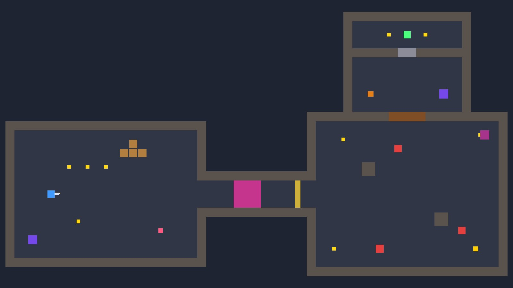

# Getting started

Gameplay Kit is a Unity package of small, independent 2D gameplay components. You build characters,
enemies and levels by stacking components from **Add Component**, and everything works with its
default values: no layers, tags or references to set up before pressing Play. This page gets the
package into your project and a playable character on screen in a few minutes.

## Requirements

- **Unity 6** (6000.0 or newer).
- 2D Physics and uGUI. They are declared as package dependencies, so Unity enables them for you.
- The **Input System** package is optional. The kit works with *Input System Package (New)*,
  *Input Manager (Old)* or *Both* — see [Input](input.md).

## Install the package

=== "Git URL"

    Open **Window → Package Manager**, click **+ → Add package from git URL…** and paste the
    repository URL with the version tag:

    ```text
    https://github.com/<user>/<repo>.git#v1.1.0
    ```

    Or add it directly to your project's `Packages/manifest.json`:

    ```json
    "com.alejocastellanos.gameplaykit": "https://github.com/<user>/<repo>.git#v1.1.0"
    ```

    Replace `<user>/<repo>` with the repository you are installing from. The `#v1.1.0` suffix pins
    the release, so your project won't change when new commits land.

=== "Local folder"

    Clone or download the package somewhere on disk, then either use **+ → Add package from disk…**
    in the Package Manager and pick its `package.json`, or reference the folder in
    `Packages/manifest.json`:

    ```json
    "com.alejocastellanos.gameplaykit": "file:/path/to/com.alejocastellanos.gameplaykit"
    ```

    This is the best option if you want to edit the package while you use it.

## Try the demo

The fastest way to see what the kit does is the demo level. It walks through the main mechanics:
platforms, a one-way platform, an enemy, spikes, a checkpoint, a ladder, a key and a locked door,
water, a conveyor belt, a lever with an elevator, a health pickup, the HUD and the pause menu.

- **GameplayKit → Create Demo Scene** builds the level and saves it as
  `Assets/GameplayKitDemo/GameplayKitDemo.unity`, with `Player` and `Enemy` prefabs in
  `Assets/GameplayKitDemo/Prefabs`. It asks you to save the current scene first.
- **GameplayKit → Create Top-Down Demo Scene** builds a small top-down dungeon and saves it as
  `Assets/GameplayKitDemo/GameplayKitTopDownDemo.unity` (prefabs `TopDownPlayer`, `TopDownChaser`,
  `TopDownTurret`, `TopDownBullet` and `TopDownPlayerBullet`). It never touches the platformer scene: 8-direction
  movement and dash, a gun aimed with the mouse (fire with left click or ++j++) plus a sword (switch with ++k++), chasing enemies, a turret, a patrol, spikes, breakable crates, a key and a locked door, a lever
  that opens a gate, teleporters, a checkpoint, the HUD and the pause menu.
  
- Both levels are listed as a sample: **Package Manager → Gameplay Kit → Samples → Demo 2D →
  Import**.

Open the scene and press Play.

## The GameplayKit menu

The **GameplayKit** menu in the menu bar builds ready-to-use objects. Each one is created at the
centre of the Scene view, selected, and can be undone with ++ctrl+z++.

| Menu item | What it creates |
|---|---|
| **Create Player** | A complete platformer character tagged `Player`: capsule collider, [CharacterController2D](../components/core/CharacterController2D.md), walk/run, double jump, dash, wall jump and wall slide, crouch, ladders, swimming, drop-through, slopes, interact, melee attack, health, knockback, death, respawn, inventory, damage flash, animator bridge and [CharacterCore](../components/core/CharacterCore.md). |
| **Create Top-Down Player** | A character for games seen from above: circle collider, [PlayerTopDownMovement](../components/movement/PlayerTopDownMovement.md), 8-direction dash, interact, melee attack, health, knockback, death and respawn. See [Top-down character](top-down-character.md). |
| **Create Enemy** | A red box that patrols (turning at walls and ledges), hurts the player on contact, and is destroyed after enough damage, with a damage flash and damage numbers. |
| **Create Platform** | A 4 × 0.5 solid block with a `BoxCollider2D`. |
| **Create 2D Camera** | An orthographic `Main Camera` (size 6) with [CameraFollow](../components/camera/CameraFollow.md) and [CameraShake](../components/camera/CameraShake.md). It follows whatever is tagged `Player`. |
| **Create Managers** | A `Managers` object with [ScoreManager](../components/managers/ScoreManager.md) and [PauseManager](../components/managers/PauseManager.md). |
| **Create HUD** | A canvas with a health bar, a score text and a pause menu (resume / restart), plus an `EventSystem` if the scene has none. |
| **Create Demo Scene** | The platformer demo level described above. |
| **Create Top-Down Demo Scene** | The top-down demo dungeon described above. |

**Player** and **Enemy** are also available from the Hierarchy context menu (right-click →
**GameplayKit**), which parents them to the object you clicked.

!!! tip "HUD texts"
    The HUD is created with Spanish placeholder texts ("Puntos: 0", "Pausa", "Reanudar",
    "Reiniciar"). Change the score label with the **Format** field of
    [UIScoreText](../components/ui/UIScoreText.md) and edit the button labels directly in the
    hierarchy.

## Default controls

| Action | Keyboard | Gamepad (Input System) |
|---|---|---|
| Move | ++a++ / ++d++ or ++arrow-left++ / ++arrow-right++ | Left stick |
| Up / down (ladders, swimming, flying, top-down) | ++w++ / ++s++ or ++arrow-up++ / ++arrow-down++ | Left stick |
| Jump | ++space++ | South button (A / Cross) |
| Run (hold) | Left ++shift++ | Left trigger |
| Crouch (hold) | Left ++ctrl++ | — |
| Dash | ++q++ | Right trigger |
| Interact | ++e++ | Select / View |
| Attack | ++j++ | West button (X / Square) |
| Special (switch weapon) | ++k++ | Right shoulder |
| Fly (toggle) | ++f++ | North button (Y / Triangle) |
| Roll | Left ++alt++ | East button (B / Circle) |
| Blink | ++c++ | Left shoulder |
| Pause | ++esc++ | Start |

A few combinations: ++s++ + ++space++ on a one-way platform drops through it, and ++s++ + ++q++ in
the air performs a ground slam (if the character has
[PlayerGroundSlam](../components/movement/PlayerGroundSlam.md)). The five actions (Attack, Special,
Fly, Roll, Blink) can be rebound in [KeyboardInputReader](../components/core/KeyboardInputReader.md).

!!! warning "Gamepad buttons need the Input System"
    With only the classic Input Manager, the kit reads movement from the **Horizontal** /
    **Vertical** axes and jump from the **Jump** button of the Input Manager; the other gamepad
    buttons are not read. Details in [Input](input.md).

## Your first five minutes

<figure class="gk-clip" markdown="0"><video src="../../assets/clips/PlayerWalkRun.mp4" poster="../../assets/clips/PlayerWalkRun.jpg" autoplay loop muted playsinline preload="metadata"></video><figcaption>Walking, then holding Shift to run — the first thing you'll try after Create Player.</figcaption></figure>

1. Create a new scene and delete its default **Main Camera** (the kit's camera replaces it).
2. **GameplayKit → Create Platform**. Scale it on X (for example to 8) to get a wider floor.
3. Move the Scene view above the platform and run **GameplayKit → Create Player**.
4. **GameplayKit → Create 2D Camera**, **Create Managers** and **Create HUD**.
5. Press Play. Walk, run with ++shift++, double jump, dash with ++q++, and jump against the side of
   the platform to wall-slide and wall-jump.
6. Add an enemy with **Create Enemy** on the platform. It patrols and hurts you on contact; hit it
   twice with ++j++ to destroy it (it has 20 HP and the default melee deals 10).

Nothing needed a layer, a tag or a reference: ground detection, wall checks and weapons ignore the
character's own colliders, so every mask can stay on *Everything*.

Now tweak something. Select the Player and set **Extra Jumps** on
[PlayerMultiJump](../components/movement/PlayerMultiJump.md) to `2` for a triple jump, or remove
[PlayerDash](../components/movement/PlayerDash.md) to take the dash away. Each ability is its own
component, so adding or removing a mechanic is just **Add Component** / **Remove Component**.

## Next steps

- [Platformer character](platformer-character.md) — build a character by hand and tune the jump.
- [Top-down character](top-down-character.md) — movement without gravity.
- [Input](input.md) — rebind keys or drive a character with your own input source.
- [Combat](combat.md) and [Health and damage](health-and-damage.md) — weapons, hits, death and respawn.
