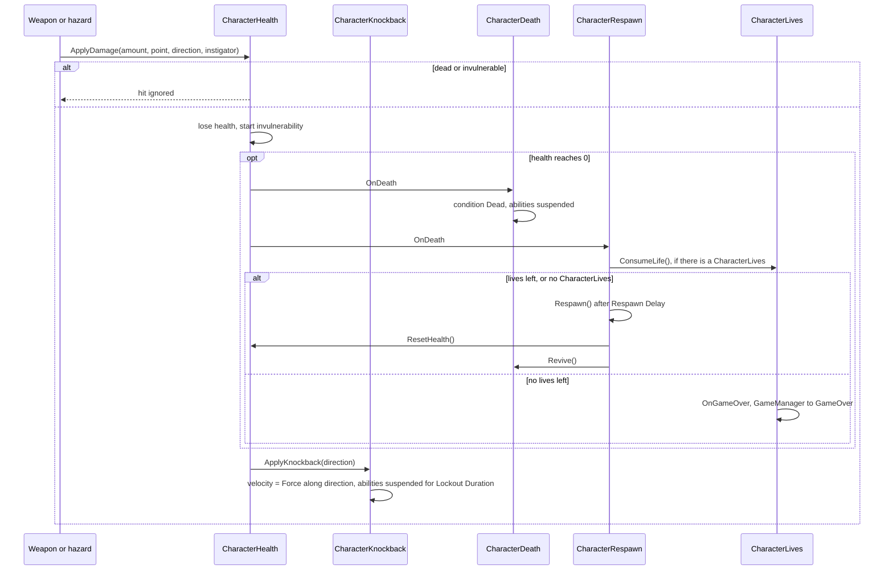

# Health and damage

This guide follows a hit from the moment a weapon touches a character until the character is back
on its feet — or the game is over. Each step is a separate component, so you can keep the ones you
need: a barrel only needs health, an enemy might add knockback, and the player usually gets the
whole chain.

## The pipeline



Weapons, [HazardZone](../components/environment/HazardZone.md) and
[EnemyMeleeOnContact](../components/ai/EnemyMeleeOnContact.md) all call `ApplyDamage` through the
`IDamageable` interface. Fall damage and the void kill call `TakeDamage` instead, which applies the
damage but **no knockback**.

## CharacterHealth

[CharacterHealth](../components/health/CharacterHealth.md) holds **Max Health** (`100`) and
`CurrentHealth`. It doesn't need `CharacterCore`, so it also works on simple enemies and props.

- `TakeDamage(amount)`, `Heal(amount)`, `ResetHealth()` (revive at full health) and
  `GrantInvulnerability(seconds)`.
- `IsDead`, `IsInvulnerable`, `CurrentHealth`, `MaxHealth`.
- C# events: `OnHealthChanged(current, max)`, `OnDamaged(amount)`, `OnHealed(amount)` and `OnDeath`.

### Invulnerability

After every hit that lands, the character ignores damage for **Invulnerability Duration** (`0.5`
s). Hits during that window are dropped, not queued. Other systems can grant extra time:
[PlayerRollDodge](../components/movement/PlayerRollDodge.md) makes the character invulnerable for
the whole roll. `GrantInvulnerability` never shortens a longer window that's already running.

## Knockback and stun

<figure class="gk-clip" markdown="0"><video src="../../assets/clips/CharacterKnockback.mp4" poster="../../assets/clips/CharacterKnockback.jpg" autoplay loop muted playsinline preload="metadata"></video><figcaption>The character is pushed away from the hit and loses control for a moment.</figcaption></figure>

With [CharacterKnockback](../components/health/CharacterKnockback.md) on the same object, every
`ApplyDamage` with a direction also pushes the character: its velocity is replaced by **Force**
(`8` u/s) along the hit direction, tilted upwards by **Upward Lift** (`0.35`). Every hit pushes the
same, whatever the damage amount or the Rigidbody2D mass, so tune **Force** to change how far
characters fly. For a one-off stronger push, call `ApplyKnockback(direction, speed)` yourself. During
**Lockout Duration** (`0.2` s) all abilities are suspended so the player's input doesn't cancel the
push.

[CharacterStun](../components/health/CharacterStun.md) suspends the abilities and sets the
condition to *Stunned* for **Default Stun Duration** (`1` s). Nothing in the kit stuns
automatically — you decide when. For example, stun on heavy hits:

```csharp
using GameplayKit.Health;
using UnityEngine;

[RequireComponent(typeof(CharacterHealth), typeof(CharacterStun))]
public class StunOnHeavyHits : MonoBehaviour
{
    [SerializeField] private float threshold = 25f;

    private CharacterHealth _health;
    private CharacterStun _stun;

    private void Awake()
    {
        _health = GetComponent<CharacterHealth>();
        _stun = GetComponent<CharacterStun>();
    }

    private void OnEnable() => _health.OnDamaged += HandleDamaged;
    private void OnDisable() => _health.OnDamaged -= HandleDamaged;

    private void HandleDamaged(float amount)
    {
        if (amount >= threshold && !_health.IsDead) _stun.Stun();
    }
}
```

## Death, respawn and lives

<figure class="gk-clip" markdown="0"><video src="../../assets/clips/CharacterRespawn.mp4" poster="../../assets/clips/CharacterRespawn.jpg" autoplay loop muted playsinline preload="metadata"></video><figcaption>After dying, the character reappears at the last checkpoint with full health.</figcaption></figure>

[CharacterDeath](../components/health/CharacterDeath.md) reacts to `OnDeath`: it sets the condition
to *Dead*, suspends the abilities, fires the **Death Animator Trigger** (`Die`) on an `Animator` in
the children if there is one, and raises `OnCharacterDeath`. **Disable Delay** can deactivate the
object after death; the default `-1` keeps it active, which is what you want for a player that
respawns.

[CharacterRespawn](../components/health/CharacterRespawn.md) brings it back after **Respawn Delay**
(`1` s) when **Auto Respawn On Death** is on: it moves the character to the current checkpoint (or
**Initial Checkpoint**, or where it started), clears its velocity, restores full health, revives it
and resets every ability, then raises `OnRespawn`. A
[Checkpoint](../components/environment/Checkpoint.md) trigger calls `SetCheckpoint` when the
player touches it. You can also call `Respawn()` yourself.

[CharacterLives](../components/health/CharacterLives.md) adds a life counter (**Starting Lives**
`3`, **Max Lives** `9`). Each death consumes one life; when the count reaches 0 the character does
not respawn, `OnGameOver` fires and, if there's a
[GameManager](../components/managers/GameManager.md), its state becomes `GameOver`.

!!! warning "Lives include the current one"
    With **Starting Lives** at `3`, the character respawns after the first and second deaths and the
    third death is game over — like the lives counter in a classic arcade game.

The kit doesn't ship a game-over screen or a lives counter UI. Both are a few lines:

```csharp
using GameplayKit.Health;
using UnityEngine;
using UnityEngine.UI;

public class LivesHud : MonoBehaviour
{
    [SerializeField] private CharacterLives lives;
    [SerializeField] private Text livesText;
    [SerializeField] private GameObject gameOverPanel;

    private void OnEnable()
    {
        lives.OnLivesChanged += HandleLivesChanged;
        lives.OnGameOver += HandleGameOver;
    }

    private void OnDisable()
    {
        lives.OnLivesChanged -= HandleLivesChanged;
        lives.OnGameOver -= HandleGameOver;
    }

    private void Start() => HandleLivesChanged(lives.Lives);

    private void HandleLivesChanged(int count) => livesText.text = $"x{count}";
    private void HandleGameOver() => gameOverPanel.SetActive(true);
}
```

## IHealthSource and visual feedback

`IHealthSource` is the read-only side of health: `CurrentHealth`, `MaxHealth` and the `Damaged` /
`Healed` events. `CharacterHealth` and [DamageableObject](../components/combat/DamageableObject.md)
implement it, and feedback components only depend on it — so they work on players, enemies and props
alike:

- [DamageFlash](../components/health/DamageFlash.md) tints every `SpriteRenderer` in the object with
  **Flash Color** for **Flash Duration** (`0.1` s) on each hit. With a `CharacterHealth`, it also
  blinks the sprites while the character is invulnerable (**Blink While Invulnerable**, every
  **Blink Interval** `0.08` s).
- [DamagePopupSpawner](../components/ui/DamagePopupSpawner.md) shows floating damage and heal numbers.
- [AIDecisionHealthThreshold](../components/ai/AIDecisionHealthThreshold.md) lets an AI brain react
  to low health.

<figure class="gk-clip" markdown="0"><video src="../../assets/clips/DamageFlash.mp4" poster="../../assets/clips/DamageFlash.jpg" autoplay loop muted playsinline preload="metadata"></video><figcaption>A red flash on the hit, then blinking while invulnerable.</figcaption></figure>

## Falling into the void

Three tools cover falls, and you can combine them:

- **[LevelManager](../components/managers/LevelManager.md)** with **Kill Below Void** on: any active
  `CharacterHealth` below **Void Y** (`-30`) takes lethal damage, then dies and respawns like any
  other death. It keeps trying every frame, so a character that was still invulnerable dies as soon
  as the window ends. It affects enemies with `CharacterHealth` too. *Create Managers* doesn't add a
  LevelManager; add it to your managers object yourself.
- **A kill zone**: a wide trigger under the level with a
  [HazardZone](../components/environment/HazardZone.md) and a huge **Damage** — the demo scene uses
  one with `9999`. Unlike the void line, it hits anything `IDamageable`.
- **[CharacterFallDamage](../components/health/CharacterFallDamage.md)** for long drops that don't
  kill outright: damage starts after **Min Fall Distance** (`5` units), at **Damage Per Unit** (`4`),
  up to **Max Damage** (`60`).

## Health bar on the HUD

[UIHealthBar](../components/ui/UIHealthBar.md) drives an `Image` set to *Filled* (**Fill Image**) or
a `Slider` (from 0 to 1) from `OnHealthChanged`. Leave **Health** empty and it uses the object tagged
`Player`, and it finds the player again if that object is replaced. **GameplayKit → Create HUD**
creates one already wired, top-left on the canvas.

## Next steps

- [Combat](combat.md) — the weapons that start the pipeline.
- [Building a level](building-a-level.md) — checkpoints, hazards and health pickups.
