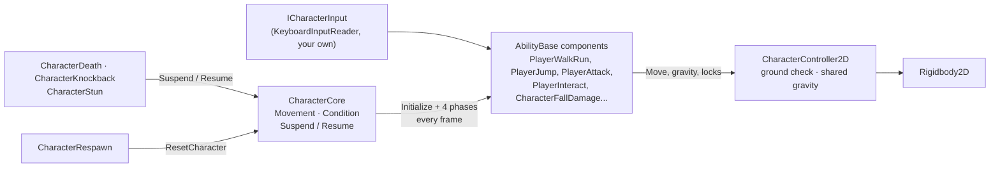
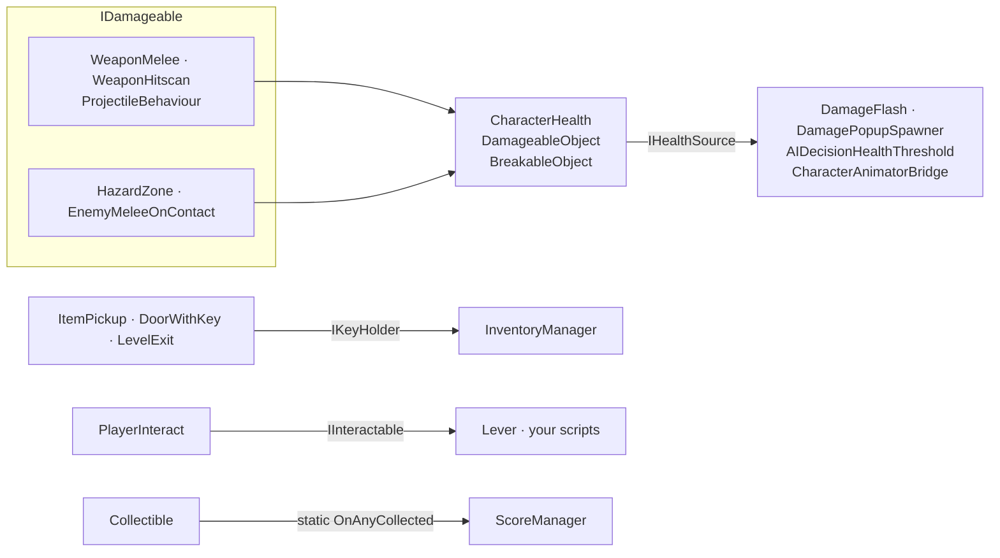

# Architecture

## Package layout

```text
com.alejocastellanos.gameplaykit/
├─ package.json            Unity 6000.0+, depends on the built-in AI, Physics 2D and UI modules + uGUI
├─ Runtime/                assembly GameplayKit.Runtime
│  ├─ Core/                GameplayKit.Core
│  ├─ Movement/            GameplayKit.Movement
│  ├─ Health/              GameplayKit.Health
│  ├─ Combat/              GameplayKit.Combat
│  ├─ AI/                  GameplayKit.AI
│  ├─ Environment/         GameplayKit.Environment
│  ├─ CameraSystem/        GameplayKit.CameraSystem
│  ├─ Managers/            GameplayKit.Managers
│  ├─ UI/                  GameplayKit.UI
│  └─ Art/                 GameplayKitSquare.png (the placeholder sprite used by the menu builders)
├─ Editor/                 assembly GameplayKit.Editor: the GameplayKit menu (GameplayKitMenu.cs)
└─ Tests/
   ├─ Editor/              assembly GameplayKit.Tests.Editor: component catalogue tests
   └─ Runtime/             assembly GameplayKit.Tests.Runtime: play-mode gameplay tests + TestWorld helpers
```

Each folder under `Runtime/` is one namespace and one category of the documentation. Every component lives
in its own file named after the class.

**Assemblies.** All runtime code is a single assembly, `GameplayKit.Runtime` (root namespace `GameplayKit`).
It references `Unity.InputSystem` and defines `GAMEPLAYKIT_INPUT_SYSTEM` through a version define when the
`com.unity.inputsystem` package (1.0.0 or newer) is installed, so the Input System is optional. The test
assemblies only compile when `UNITY_INCLUDE_TESTS` is defined, which happens when the package is listed in
`testables`.

## The character core



- **`CharacterCore`** owns two state machines (`Movement`, `Condition`), discovers every `AbilityBase` on the
  object and its children in `Awake`, and runs them in four phases each `Update`: `HandleInput`,
  `EarlyProcessAbility`, `ProcessAbility`, `LateProcessAbility`, skipping abilities that are unticked or have
  `AbilityEnabled = false`. An ability that throws is disabled on its own.
  See [Custom abilities](../guides/custom-abilities.md#how-charactercore-runs-abilities).
- **`CharacterController2D`** wraps the `Rigidbody2D`: ground detection, velocity helpers, shared gravity
  (`OverrideGravity`/`ReleaseGravity`), a temporary horizontal-control lock and a per-frame jump block.
- **`ICharacterInput`** is the only way abilities read input. `KeyboardInputReader` is the default
  implementation (keyboard, mouse and gamepad through `InputCompat`). Tests use `ScriptedCharacterInput`, and
  you can plug in AI or replays.
- Health components are *not* abilities. `CharacterHealth` works on any object, and the components that react
  to it (`CharacterDeath`, `CharacterKnockback`, `CharacterStun`) talk to the core through `Suspend`/`Resume`
  and the `Condition` state when a core is present.

## How categories talk to each other

Categories never depend on each other's concrete classes for their main interactions. They meet through
four small interfaces in `GameplayKit.Core`, one static event and a few optional singletons:



| Contract | Implemented by | Used by |
|---|---|---|
| `IDamageable` | `CharacterHealth`, `DamageableObject`, `BreakableObject` | `WeaponMelee`, `WeaponHitscan`, `ProjectileBehaviour`, `HazardZone`, `EnemyMeleeOnContact`, `CharacterAimAndOrient` (to find targets) |
| `IHealthSource` | `CharacterHealth`, `DamageableObject` | `DamageFlash`, `DamagePopupSpawner`, `AIDecisionHealthThreshold`, `CharacterAnimatorBridge` |
| `IKeyHolder` | `InventoryManager` | `ItemPickup`, `DoorWithKey`, `LevelExit` |
| `IInteractable` | `Lever` | `PlayerInteract` |
| `Collectible.OnAnyCollected` (static event) | `Collectible` | `ScoreManager` |

The remaining direct links are optional lookups. Each one checks for `null` and works without the other side:

| From | To | Why |
|---|---|---|
| `Checkpoint` | `CharacterRespawn`, `LevelManager.Instance` | Store the respawn point. |
| `CameraBounds` | `LevelManager.Instance` | Use the level bounds when the camera has none. |
| `LevelManager` | `CharacterHealth.Active` | Kill characters below the void. |
| `CharacterLives` | `GameManager.Instance` | Switch to `GameOver`. |
| `PauseManager` | `GameManager.Instance` | Switch between `Playing` and `Paused` (never over `GameOver`). |
| `LevelExit` | `SceneTransitionManager.Instance` | Fade when loading. |
| `UIScoreText`, `UIPauseMenu` | `ScoreManager.Instance`, `PauseManager.Instance` | Show the score, show/hide the menu. |
| `UIHealthBar` | `CharacterHealth` | Health bar. |
| `PlayerSwim` | `WaterZone` | Recognise water without a tag. |
| `PlayerRollDodge` | `CharacterHealth` | Invulnerability during the roll. |
| `AIActionShoot`, `EnemyShootOnSight`, `PlayerAttack` | Combat weapons | Fire the weapon on the same object. |

In terms of namespaces: `Core` depends on nothing else in the kit. `Combat` uses `Core`. `AI` uses `Core` and
`Combat`. `CameraSystem` only looks up `LevelManager`. `Movement`, `Health`, `Environment`, `Managers` and
`UI` use `Core` plus the optional links above.

## Design principles

### Zero-config defaults

A component should do something sensible the moment it's added, with every reference optional:

- `CharacterCore` adds a `KeyboardInputReader` when there's no input source.
- `CharacterController2D` finds the ground from the collider's bounds (no ground-check object needed), freezes
  the body's rotation and gives the collider a frictionless material so characters don't stick to walls.
- Cameras, health bars, spawners, zoom and the standalone enemy behaviours (`EnemyChase`, `EnemyFlee`,
  `EnemyShootOnSight`, through [PlayerLocator](core-api.md#playerlocator)) find the `Player`-tagged object when
  their target is empty.
- Persistent managers can sit under any parent: they move themselves to the scene root before
  `DontDestroyOnLoad`.
- `AudioManager` creates its audio sources and `SceneTransitionManager` its fade layer.
- Waypoints and bounds can be children of the object that uses them. Their world positions are copied at
  start (`MovingPlatform`, `Elevator`, `EnemyPatrolWithinBounds`, `AIActionPatrolPoints`), so they don't move
  with it.
- `PlayerCrouch` reads the standing collider size at start. `OneWayPlatform` adds its own collider and
  effector.

### *Everything* layers and self-ignoring queries

Ground, wall, ledge and sight checks usually start *inside* the collider of whoever is asking. With raw
`Physics2D` calls, that collider detects itself, and the usual workaround is a "Player" layer excluded from
every mask. Instead, the kit routes those checks through [PhysicsQuery2D](core-api.md#physicsquery2d), whose
`Raycast` and `OverlapCircle` skip colliders that belong to the asker (itself, its children, or anything on
its Rigidbody2D) and skip triggers unless asked. That's why every layer mask can default to *Everything*.

### Tolerant tags

`CompareTag` throws when the tag doesn't exist in the Tag Manager, which would break a freshly added component
in a project that never created that tag. [TagFilter](core-api.md#tagfilter) compares tags safely, and also
accepts the tag of a collider's Rigidbody2D, so colliders on child objects count as the player. Optional tags
(`Ladder`, `Water`, `RopeAnchor`) have marker components as an alternative.

### Sleeping bodies in zones and on platforms

Unity stops sending `OnTriggerStay2D` once a `Rigidbody2D` falls asleep, which happens when a player stands
still. A spike zone using `Stay` would stop hurting a player who stops moving. Zones that act "while you're
inside" (`HazardZone`, `HealthPickup`, `WindZone2D`, `WaterZone`) track occupants with Enter/Exit in
`TriggerOccupants` and apply their effect from `Update`/`FixedUpdate`. They count colliders per occupant, so a
character with several colliders doesn't "leave" early. Moving platforms, elevators and conveyors move their
riders with `PlatformRiders`, which shifts each rider by the platform's displacement and wakes it up.
Parenting doesn't work for dynamic bodies.

### Shared state with owners

Anything several systems want to change at once has an owner-based API instead of a plain setter: gravity
overrides (`OverrideGravity(owner, scale)`, last one wins), ability suspension (`Suspend(source)`), the
horizontal control lock (only extends) and the jump block (one frame).

### Fault isolation

An ability that throws is disabled once, with a clear Console message, instead of halting the loop for every
ability after it and repeating the error every frame.

### Never load scenes by surprise

Only `LevelExit`, `SceneTransitionManager` and the pause menu buttons load scenes, and only when asked. The
demo scene's goal is a collectible for that reason.
