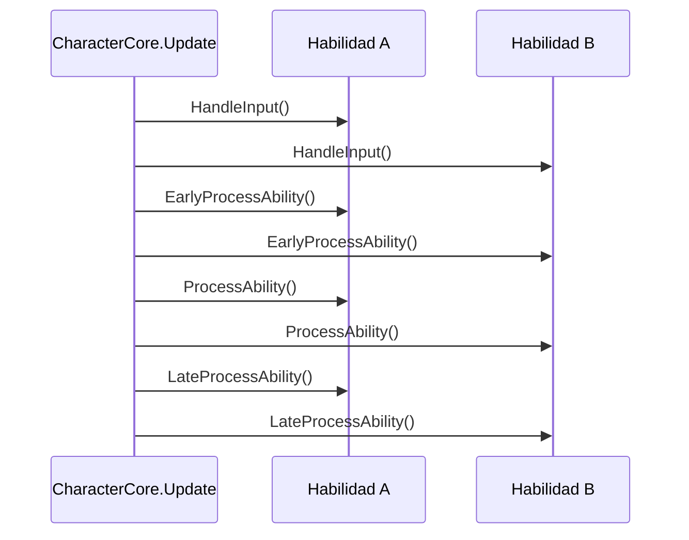

# Habilidades propias

Cada mecánica de un personaje de Gameplay Kit, desde caminar hasta el wall jump o atacar, es una habilidad:
un componente derivado de `AbilityBase` que `CharacterCore` ejecuta cada frame. Escribir la tuya usa
exactamente el mismo contrato que las habilidades incluidas. Esta guía explica cómo funciona ese contrato y
después arma una habilidad nueva desde cero.

## Cómo ejecuta CharacterCore las habilidades

### Descubrimiento

En `Awake`, [CharacterCore](../components/core/CharacterCore.md):

1. Crea dos máquinas de estados, `Movement` (un `MovementState`, empieza en `Idle`) y `Condition` (un
   `ConditionState`, empieza en `Normal`), y toma el `CharacterController2D`.
2. Agrega un `KeyboardInputReader` si ningún componente del GameObject implementa `ICharacterInput`.
3. Junta todas las `AbilityBase` del GameObject **y sus hijos** (incluso las inactivas) y llama
   `Initialize(this)` en cada una.

El descubrimiento ocurre una sola vez. En una escena todos los componentes existen antes de que corra
cualquier `Awake`, así que el orden no importa. Cuando armas un personaje por código, agrega `CharacterCore`
**al final** (o arma el GameObject inactivo y actívalo al terminar). Una habilidad agregada después de que el
core despertó nunca se ejecuta.

### El frame

En cada `Update`, salvo que la condición sea `Paused` o las habilidades estén suspendidas, el core ejecuta
**cuatro fases**, y cada fase recorre *todas* las habilidades antes de empezar la siguiente:



| Fase | Para qué sirve | Ejemplo en el kit |
|---|---|---|
| `HandleInput` | Leer el input crudo a campos propios. | — |
| `EarlyProcessAbility` | Detectar condiciones o "reclamar" algo antes de que otras habilidades actúen. | `PlayerJump` registra cuándo tocó suelo por última vez; `PlayerDropThrough` bloquea el salto de este frame. |
| `ProcessAbility` | La lógica principal: cambiar velocidad y estado. | Casi todas las habilidades de movimiento. |
| `LateProcessAbility` | Ajustes finales, cuando todos ya se movieron. | — |

Como las fases son globales, una habilidad puede influir en otra sin importar el orden de los componentes.
Por ejemplo, `PlayerDropThrough` llama `BlockJumpThisFrame()` en *Early* y `PlayerJump` revisa
`IsJumpBlocked` en *Process*, así abajo + salto sobre una plataforma de un sentido la atraviesa en vez de
saltar.

**Dentro** de una fase, las habilidades corren en el orden que devuelve `GetComponentsInChildren`: el orden de
los componentes en el Inspector (primero los del objeto, después los de sus hijos). Ese orden importa cuando
dos habilidades escriben el mismo valor en la misma fase: gana la que va después. Por eso `PlayerCrouch` (que
reduce la velocidad horizontal) debe ir **debajo** de `PlayerWalkRun`.

### Activar, suspender y aislar fallas

- **`AbilityEnabled`** y la casilla del componente en el Inspector (`enabled`) se revisan las dos: una
  habilidad con `AbilityEnabled = false`, o con el componente desmarcado, se salta en todas las fases.
  Desmárcala en el Inspector mientras pruebas, o cambia cualquiera de las dos desde código. Desmarcarla
  también llama a tu `OnDisable`, así que libera ahí las anulaciones de gravedad y los bloqueos.
- **`Suspend(source)` / `Resume(source)`** pausan *todas* las habilidades en nombre de un objeto, sin tocar su
  `AbilityEnabled`. Varias fuentes pueden suspender a la vez; las habilidades vuelven cuando todas hicieron
  `Resume`. `CharacterKnockback` suspende durante un instante, `CharacterStun` durante el aturdimiento y
  `CharacterDeath` hasta el respawn. `AbilitiesSuspended` indica si alguien las tiene en pausa.
- **Aislamiento de fallas**: si una habilidad lanza una excepción en cualquier fase, el core pone su
  `AbilityEnabled` en false, registra una vez `[GameplayKit] <Habilidad> en '<objeto>' lanzó una excepción y
  se desactivó` junto con la excepción, y sigue ejecutando las demás. Una habilidad rota no congela al
  personaje ni llena la consola cada frame.
- **`ResetCharacter()`**, que llama `CharacterRespawn`, borra todas las suspensiones, pone `Movement` en
  `Idle` y `Condition` en `Normal`, y llama `ResetAbility()` en cada habilidad.

## Qué te da AbilityBase

| Miembro | Qué es |
|---|---|
| `protected CharacterCore Character` | El core. A través de él: `Controller`, `Movement`, `Condition`, `Suspend`/`Resume`. |
| `protected ICharacterInput CharacterInput` | La fuente de input que encontró en el personaje al inicializarse. |
| `bool AbilityEnabled { get; set; }` | Si el core ejecuta esta habilidad (por defecto `true`). El core también se la salta mientras el componente esté desactivado. |
| `virtual void Initialize(CharacterCore character)` | La llama el core una vez. Sobrescríbela para guardar componentes y **llama siempre primero a `base.Initialize(character)`**, que es lo que asigna `Character` y `CharacterInput`. |
| `virtual void HandleInput()` | Fase 1. |
| `virtual void EarlyProcessAbility()` | Fase 2. |
| `virtual void ProcessAbility()` | Fase 3. |
| `virtual void LateProcessAbility()` | Fase 4. |
| `virtual void ResetAbility()` | Se llama cuando el personaje reaparece o se reinicia. Deshaz aquí cualquier estado temporal (gravedad anulada, banderas, temporizadores). |

`Initialize` puede ejecutarse antes que el `Awake` de tu habilidad, porque lo llama el `Awake` del core. Haz tu
preparación en `Initialize`, no en `Awake`.

## Qué te da CharacterController2D

Las habilidades deberían mover al personaje a través de
[CharacterController2D](../components/core/CharacterController2D.md) en lugar de tocar el `Rigidbody2D`
directamente:

| Miembro | Uso |
|---|---|
| `IsGrounded` | Chequeo de suelo, actualizado en cada paso de física con un círculo pequeño bajo el collider (o en **Ground Check**). |
| `Velocity`, `Move(Vector2)`, `SetVerticalVelocity(float)` | Leer y escribir la velocidad del cuerpo. |
| `Rigidbody` | El `Rigidbody2D` de abajo, cuando de verdad lo necesites. |
| `OverrideGravity(owner, scale)` / `ReleaseGravity(owner)` / `IsGravityOverridden` | Gravedad compartida, ver abajo. |
| `DefaultGravityScale`, `GravityMultiplier` | Gravedad base (el **Gravity Scale** original del cuerpo) y un multiplicador que usa `CharacterGravityController` para caer más rápido. |
| `LockHorizontalControl(seconds)` / `IsHorizontalControlLocked` | Pedirle al movimiento base que no toque la velocidad horizontal por un rato. |
| `BlockJumpThisFrame()` / `IsJumpBlocked` | Reclamar el botón de salto de este frame para que las habilidades de salto lo ignoren. |

### Compartir la gravedad

Muchas habilidades necesitan apagar la gravedad un rato: escaleras, nado, vuelo, cornisas, tirolesas, cuerdas,
pendientes, seguir rutas, movimiento top-down. Si cada una escribiera `gravityScale` directamente, una que la
libera rompería a otra que todavía la necesita. En cambio:

- `OverrideGravity(this, scale)` registra (o actualiza) tu anulación; se aplica la **más reciente**.
- `ReleaseGravity(this)` quita solo *tu* anulación. Cuando no queda ninguna, la gravedad vuelve a
  `DefaultGravityScale × GravityMultiplier`.

La regla para tus habilidades: cada `OverrideGravity` necesita su `ReleaseGravity`, al terminar la
habilidad, en `ResetAbility` y cuando el componente se desactiva.

### Bloquear el control horizontal

`PlayerWalkRun` escribe la velocidad horizontal desde el input cada frame, lo que anularía cualquier empujón
que apliques. Llama `LockHorizontalControl(seconds)` cuando tu habilidad se adueña de la velocidad
horizontal (`PlayerWallJump` lo hace para el impulso, `PlayerRollDodge` para la rodada). Los bloqueos solo se
alargan, nunca se acortan. Si tu habilidad es un movimiento "base", respeta `IsHorizontalControlLocked` igual
que `PlayerWalkRun`.

## Paso a paso: una habilidad de flotar

Vamos a armar `PlayerHover`: al pulsar una acción en el aire, el personaje flota en el lugar hasta 1.5
segundos, pudiendo desplazarse despacio hacia los lados. Se recarga al aterrizar.

### 1. Crea la clase

Crea `PlayerHover.cs`. El nombre del archivo debe coincidir con el de la clase, o Unity mostrará *Missing
Script* al guardar.

```csharp
using System;
using GameplayKit.Core;
using UnityEngine;

public class PlayerHover : AbilityBase
{
    [Tooltip("Action that starts hovering. Its key is bound in KeyboardInputReader (Special = K by default).")]
    [SerializeField] private CharacterAction hoverAction = CharacterAction.Special;
    [SerializeField] private float maxHoverTime = 1.5f;
    [SerializeField] private float driftSpeed = 3f;

    public bool IsHovering { get; private set; }
    public float HoverTimeLeft { get; private set; }
    public event Action<bool> OnHoverChanged;

    private bool _wantsHover;
}
```

### 2. Inicializa

Llena el tanque cuando el core te entrega el personaje:

```csharp
    public override void Initialize(CharacterCore character)
    {
        base.Initialize(character);   // asigna Character y CharacterInput
        HoverTimeLeft = maxHoverTime;
    }
```

### 3. Lee el input

Solo una pulsación en el aire empieza a flotar; soltar la acción lo termina:

```csharp
    public override void HandleInput()
    {
        if (CharacterInput.GetActionDown(hoverAction) && !Character.Controller.IsGrounded) _wantsHover = true;
        if (!CharacterInput.GetAction(hoverAction)) _wantsHover = false;
    }
```

### 4. Detecta el aterrizaje temprano

Recarga y deja de flotar apenas el personaje toca el suelo, antes de que nadie procese este frame:

```csharp
    public override void EarlyProcessAbility()
    {
        if (!Character.Controller.IsGrounded) return;
        HoverTimeLeft = maxHoverTime;
        if (IsHovering) StopHover();
    }
```

### 5. La lógica principal

Empieza, mantiene o termina la flotación, y mueve al personaje mientras dura:

```csharp
    public override void ProcessAbility()
    {
        bool canHover = Character.Condition.CurrentState == ConditionState.Normal
                        && !Character.Controller.IsGrounded
                        && HoverTimeLeft > 0f;

        if (_wantsHover && canHover && !IsHovering) StartHover();
        else if (IsHovering && (!_wantsHover || !canHover)) StopHover();

        if (!IsHovering) return;

        HoverTimeLeft -= Time.deltaTime;
        Character.Controller.Move(new Vector2(CharacterInput.MoveInput.x * driftSpeed, 0f));
    }
```

`PlayerWalkRun` también escribe la velocidad horizontal en `ProcessAbility`, conservando la vertical (que es 0
mientras flotas), así que las dos se llevan bien: la que vaya después en el Inspector decide la velocidad
horizontal. Si quieres que siempre gane la velocidad de la flotación, mueve la llamada a `Move` a
`LateProcessAbility`.

### 6. Comparte la gravedad como corresponde

```csharp
    private void StartHover()
    {
        IsHovering = true;
        Character.Controller.OverrideGravity(this, 0f);
        Character.Controller.SetVerticalVelocity(0f);
        OnHoverChanged?.Invoke(true);
    }

    private void StopHover()
    {
        IsHovering = false;
        _wantsHover = false;
        Character.Controller.ReleaseGravity(this);
        OnHoverChanged?.Invoke(false);
    }
```

### 7. Limpia al reiniciar y al desactivar

Si el personaje muere flotando, `CharacterDeath` suspende las habilidades, así que `ProcessAbility` deja de
correr y no puede liberar la gravedad. Después `CharacterRespawn` llama `ResetCharacter`, que llega a tu
`ResetAbility`:

```csharp
    public override void ResetAbility()
    {
        if (IsHovering) StopHover();
        HoverTimeLeft = maxHoverTime;
        _wantsHover = false;
    }

    private void OnDisable()
    {
        if (IsHovering) StopHover();
    }
```

### 8. Agrégala al personaje

Agrega `PlayerHover` a tu jugador junto a las demás habilidades. *Create Player* ya tiene un `CharacterCore`, y
en una escena el core descubre las habilidades al cargar el nivel. Dale Play, salta y mantén **K**.

!!! tip "Elige una acción libre"
    `PlayerAttack` usa **Special** para cambiar de arma cuando hay un `WeaponInventorySlot`, y `PlayerFly` usa
    **Fly**. Elige otra **Hover Action** o reasigna teclas en **Action Bindings** de `KeyboardInputReader`.

??? example "PlayerHover.cs completo"
    ```csharp
    using System;
    using GameplayKit.Core;
    using UnityEngine;

    public class PlayerHover : AbilityBase
    {
        [Tooltip("Action that starts hovering. Its key is bound in KeyboardInputReader (Special = K by default).")]
        [SerializeField] private CharacterAction hoverAction = CharacterAction.Special;
        [SerializeField] private float maxHoverTime = 1.5f;
        [SerializeField] private float driftSpeed = 3f;

        public bool IsHovering { get; private set; }
        public float HoverTimeLeft { get; private set; }
        public event Action<bool> OnHoverChanged;

        private bool _wantsHover;

        public override void Initialize(CharacterCore character)
        {
            base.Initialize(character);
            HoverTimeLeft = maxHoverTime;
        }

        public override void HandleInput()
        {
            if (CharacterInput.GetActionDown(hoverAction) && !Character.Controller.IsGrounded) _wantsHover = true;
            if (!CharacterInput.GetAction(hoverAction)) _wantsHover = false;
        }

        public override void EarlyProcessAbility()
        {
            if (!Character.Controller.IsGrounded) return;
            HoverTimeLeft = maxHoverTime;
            if (IsHovering) StopHover();
        }

        public override void ProcessAbility()
        {
            bool canHover = Character.Condition.CurrentState == ConditionState.Normal
                            && !Character.Controller.IsGrounded
                            && HoverTimeLeft > 0f;

            if (_wantsHover && canHover && !IsHovering) StartHover();
            else if (IsHovering && (!_wantsHover || !canHover)) StopHover();

            if (!IsHovering) return;

            HoverTimeLeft -= Time.deltaTime;
            Character.Controller.Move(new Vector2(CharacterInput.MoveInput.x * driftSpeed, 0f));
        }

        public override void ResetAbility()
        {
            if (IsHovering) StopHover();
            HoverTimeLeft = maxHoverTime;
            _wantsHover = false;
        }

        private void StartHover()
        {
            IsHovering = true;
            Character.Controller.OverrideGravity(this, 0f);
            Character.Controller.SetVerticalVelocity(0f);
            OnHoverChanged?.Invoke(true);
        }

        private void StopHover()
        {
            IsHovering = false;
            _wantsHover = false;
            Character.Controller.ReleaseGravity(this);
            OnHoverChanged?.Invoke(false);
        }

        private void OnDisable()
        {
            if (IsHovering) StopHover();
        }
    }
    ```

### 9. Pruébala

Los helpers de prueba del kit también sirven para tus habilidades (ver [Pruebas](../reference/testing.md)). En
un assembly de pruebas de play mode que referencie `GameplayKit.Runtime` y `GameplayKit.Tests.Runtime`:

```csharp
using System.Collections;
using GameplayKit.Core;
using GameplayKit.Movement;
using GameplayKit.Tests;
using NUnit.Framework;
using UnityEngine;
using UnityEngine.TestTools;

public class PlayerHoverTests
{
    private TestWorld _world;

    [SetUp] public void SetUp() => _world = new TestWorld();
    [TearDown] public void TearDown() => _world.Dispose();

    [UnityTest]
    public IEnumerator Hover_HoldsHeight_ThenFallsWhenTimeRunsOut()
    {
        _world.Ground();
        var player = _world.Player(new Vector2(0f, 0.5f), out var input, typeof(PlayerJump), typeof(PlayerHover));
        while (!player.Controller.IsGrounded) yield return null;

        input.Jump = true;
        yield return new WaitForSeconds(0.3f);
        input.Jump = false;
        input.Hold(CharacterAction.Special);
        yield return new WaitForSeconds(0.2f);

        float y = player.transform.position.y;
        yield return new WaitForSeconds(0.5f);
        Assert.AreEqual(y, player.transform.position.y, 0.05f, "Hovering keeps the height");

        yield return new WaitForSeconds(1.5f);
        Assert.Less(player.transform.position.y, y - 0.5f, "Falls once the hover time is used up");
        input.Release(CharacterAction.Special);
    }
}
```

## Lista de control para tus habilidades

- Hereda de `AbilityBase`, una clase por archivo con el mismo nombre.
- Sobrescribe `Initialize` para preparar todo y llama primero a `base.Initialize(character)`.
- Lee el input con `CharacterInput`, nunca con `UnityEngine.Input`: así funciona con IA, replays y pruebas.
- Mueve al personaje con `Character.Controller`; cada `OverrideGravity` con su `ReleaseGravity`.
- Bloquea el control horizontal cuando te adueñas de la velocidad horizontal.
- Respeta `Character.Condition` (`Stunned`, `Dead`) si tu habilidad podría correr cuando no debe.
- Deshaz el estado temporal en `ResetAbility`.
- Para apagar una habilidad en runtime usa `AbilityEnabled = false` o desactiva el componente (`enabled = false`).
