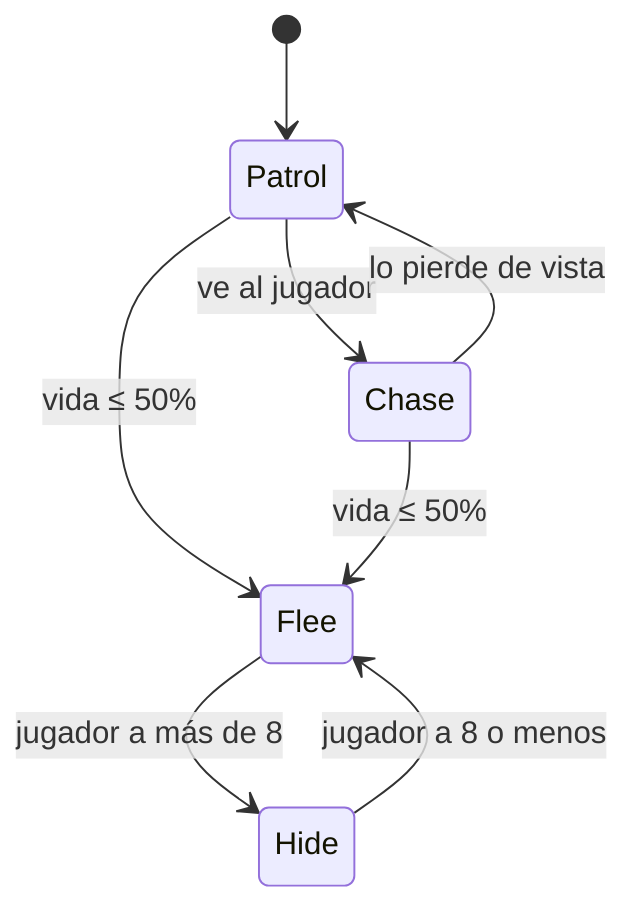

# Enemigos e IA

Gameplay Kit te da dos formas de hacer que un enemigo piense:

- **Comportamientos independientes** (`EnemyPatrol`, `EnemyChase`, `EnemyFlee`, `EnemyShootOnSight`...): un
  componente hace una sola cosa, todo el tiempo. Lo agregas y listo.
- **`AIBrain`**, una máquina de estados que armas en el Inspector con **acciones** pequeñas (qué hace el
  enemigo) y **decisiones** (cuándo cambia de idea). Úsalo cuando un enemigo tiene que alternar entre
  comportamientos, por ejemplo patrullar hasta verte y entonces perseguirte.

Ambos viven en el namespace `GameplayKit.AI` y funcionan con el mismo cuerpo de enemigo.

## El cuerpo del enemigo

Un enemigo es simplemente un GameObject con un `Collider2D` y un `Rigidbody2D`. Cada componente de movimiento
fija la velocidad horizontal del cuerpo y deja la vertical a la gravedad. **GameplayKit → Create Enemy** arma
uno completo:

| Componente | Para qué está |
|---|---|
| `BoxCollider2D` (0.9 × 0.9) + `Rigidbody2D` con **Freeze Rotation** | El cuerpo físico. |
| [EnemyPatrol](../components/ai/EnemyPatrol.md) | Camina y se da vuelta en paredes y bordes. |
| [EnemyMeleeOnContact](../components/ai/EnemyMeleeOnContact.md) | Daña al jugador al tocarlo: 10 de daño, como mucho una vez por segundo, solo a objetos con tag `Player`. |
| [DamageableObject](../components/combat/DamageableObject.md) | 20 de vida; se destruye al llegar a cero. Las armas lo golpean a través de `IDamageable`. |
| [DamageFlash](../components/health/DamageFlash.md) y [DamagePopupSpawner](../components/ui/DamagePopupSpawner.md) | Tinte y números flotantes al recibir golpes. |

El objeto se llama "Enemy" y no tiene tag: nada del kit necesita que los enemigos tengan uno. Si un enemigo
necesita frames de invulnerabilidad, knockback o animación de muerte, usa
[CharacterHealth](../components/health/CharacterHealth.md) en lugar de `DamageableObject`. Ambos implementan
`IHealthSource`, así que las decisiones de IA y los componentes de feedback funcionan con cualquiera de los
dos.

## Comportamientos independientes

<figure class="gk-clip" markdown="0"><video src="../../../assets/clips/EnemyPatrol.mp4" poster="../../../assets/clips/EnemyPatrol.jpg" autoplay loop muted playsinline preload="metadata"></video><figcaption>EnemyPatrol se da vuelta en las paredes y en el borde de su plataforma sin configurar nada.</figcaption></figure>

| Componente | Qué hace | ¿Necesita objetivo? |
|---|---|---|
| [EnemyPatrol](../components/ai/EnemyPatrol.md) | Camina en línea recta a **Speed** 2 y gira en paredes y bordes. Sin **Wall Check**/**Edge Check** lanza los rayos desde los bordes de su propio collider. | No |
| [EnemyPatrolWithinBounds](../components/ai/EnemyPatrolWithinBounds.md) | Va y viene entre una posición X izquierda y una derecha. Los límites pueden ser hijos: sus posiciones se leen una vez al iniciar. No revisa paredes ni bordes. | No |
| [EnemyChase](../components/ai/EnemyChase.md) | Se mueve en horizontal hacia el objetivo mientras esté dentro de **Detection Range** (8) y se detiene a **Stopping Distance** (0.5). Se voltea para mirarlo. | Sí (vacío = tag `Player`) |
| [EnemyFlee](../components/ai/EnemyFlee.md) | Huye del objetivo mientras esté dentro de **Flee Range** (6), mirando hacia donde corre. | Sí (vacío = tag `Player`) |
| [EnemyShootOnSight](../components/ai/EnemyShootOnSight.md) | Dispara el `WeaponHitscan` o `WeaponProjectile` del mismo objeto cuando el objetivo está dentro de un cono (**Sight Range** 10, **Sight Angle** 60) sin nada en medio. No se mueve. | Sí (vacío = tag `Player`) |
| [EnemyMeleeOnContact](../components/ai/EnemyMeleeOnContact.md) | Daña a cualquier `IDamageable` que toque (por colisión o trigger), filtrado por **Target Tag**. | Solo el tag |
| [EnemyPathfindingAgent](../components/ai/EnemyPathfindingAgent.md) | *Experimental.* Mueve un `NavMeshAgent` hacia el objetivo. Necesita un NavMesh sobre el plano XY (por ejemplo de NavMeshPlus); sin él no hace nada. | Sí |

Combinaciones que funcionan bien:

- **Patrulla + daño por contacto**: el enemigo clásico de plataformas, justo lo que arma *Create Enemy*.
- **Patrulla + disparo a la vista**: `EnemyPatrol`, `EnemyShootOnSight` y un `WeaponProjectile` (o
  `WeaponHitscan`). El cono de visión usa la dirección en la que mira (el signo de `localScale.x`), que
  `EnemyPatrol` voltea, así que solo dispara a lo que tiene adelante.
- **Persecución + daño por contacto**: un perseguidor que lastima al tocarte.

!!! warning "No combines dos componentes de movimiento"
    `EnemyPatrol`, `EnemyPatrolWithinBounds`, `EnemyChase` y `EnemyFlee` escriben cada frame la velocidad del
    Rigidbody2D. Si pones dos en el mismo enemigo, gana el que se actualice último. Para alternar entre
    patrullar y perseguir, usa un `AIBrain`.

`EnemyChase`, `EnemyFlee` y `EnemyShootOnSight` usan el **Target** que asignes en el Inspector y, si está
vacío, buscan solos el GameObject con tag `Player` (con `PlayerLocator`, como mucho cada medio segundo). Así
los prefabs que se instancian en runtime funcionan siempre que tu jugador tenga el tag. Cada uno expone además
una propiedad pública `Target` para cambiarlo desde código, y `EnemySpawner` la llena en los enemigos que
genera.

## AIBrain: estados, acciones y decisiones

<figure class="gk-clip" markdown="0"><video src="../../../assets/clips/AIBrain.mp4" poster="../../../assets/clips/AIBrain.jpg" autoplay loop muted playsinline preload="metadata"></video><figcaption>Un AIBrain cambiando de estado cuando el jugador se acerca y se aleja.</figcaption></figure>

[AIBrain](../components/ai/AIBrain.md) guarda una lista de **States**. Cada estado tiene:

- **Name**: el texto con el que lo nombran las transiciones (distingue mayúsculas).
- **Actions**: componentes derivados de `AIActionBase`. En cada frame que el estado está activo se llama el
  `PerformAction(brain)` de cada acción, en el orden de la lista.
- **Transitions**: cada una tiene una **Decision** (un componente derivado de `AIDecisionBase`), un **True
  Target State** y un **False Target State**. Un destino vacío significa "quedarse aquí".

En cada frame el cerebro primero ejecuta las acciones del estado actual y después revisa sus transiciones de
arriba hacia abajo. En cada una llama `Decide(brain)` y toma el destino verdadero o falso. La primera
transición que apunta a un estado *distinto* gana: el cerebro llama `OnExitState` en las acciones del estado
viejo, cambia, llama `OnEnterState` en las del nuevo y no evalúa las transiciones restantes. Por eso el orden
de la lista de transiciones es tu orden de prioridad.

Al iniciar, el cerebro entra en **Initial State**, o en el primer estado de la lista si está vacío. Sin estados
no hace nada. Si una transición apunta a un nombre que no existe, avisa en la consola y se queda donde está.

Las acciones y decisiones son componentes normales, casi siempre en el mismo enemigo. No tienen `Update`
propio y solo corren cuando un estado las referencia, así que tener una de sobra en el objeto no molesta. Si
desmarcas una en el Inspector, el cerebro se la salta: una acción desactivada no ejecuta su `PerformAction` y
una transición cuya decisión está desactivada se ignora. El mismo componente de decisión puede usarse en
varias transiciones de distintos estados.

### El objetivo

Todas las acciones y decisiones incluidas leen `brain.Target`, normalmente el jugador. Hay tres formas de
asignarlo:

1. Arrastrarlo al campo **Target** en el Inspector.
2. Dejar que un [EnemySpawner](#generar-enemigos) lo asigne: lo hace cuando el cerebro generado no tiene
   objetivo, usando el **Target** del spawner o, si está vacío, el objeto con tag `Player`.
3. Asignarlo por código: `brain.Target = player.transform;`

Sin objetivo, las acciones incluidas no hacen nada y las decisiones basadas en el objetivo devuelven false.

### Acciones incluidas

| Acción | Hace |
|---|---|
| [AIActionPatrolPoints](../components/ai/AIActionPatrolPoints.md) | Camina entre los **Waypoints** comparando solo la X, así que un punto un poco más alto o más bajo que el suelo también se alcanza. Con **Loop** apagado se detiene en el último y marca `Finished`. Se voltea hacia donde camina. |
| [AIActionMoveToTarget](../components/ai/AIActionMoveToTarget.md) | Se mueve en horizontal hacia el objetivo a **Speed** 3 y se detiene dentro de **Stopping Distance** (0.3). No voltea al enemigo. |
| [AIActionFlee](../components/ai/AIActionFlee.md) | Se aleja en horizontal del objetivo a **Speed** 3.5. No voltea al enemigo. |
| [AIActionShoot](../components/ai/AIActionShoot.md) | Dispara el `WeaponHitscan` o `WeaponProjectile` del mismo objeto hacia el objetivo cada **Fire Interval** (1 s); el primer disparo sale apenas entra al estado. |
| [AIActionWait](../components/ai/AIActionWait.md) | Nada: sirve para estados de espera o de "esconderse", normalmente con una decisión por tiempo. |

Las acciones de movimiento ponen en cero la velocidad horizontal en `OnExitState`, así el enemigo no sigue
deslizándose al cambiar de estado.

### Decisiones incluidas

| Decisión | Es verdadera cuando |
|---|---|
| [AIDecisionTargetInRange](../components/ai/AIDecisionTargetInRange.md) | El objetivo está a **Range** (6) unidades o menos, en cualquier dirección. |
| [AIDecisionLineOfSight](../components/ai/AIDecisionLineOfSight.md) | El objetivo está dentro de **Max Distance** (10) y un rayo hacia él no choca con nada de **Obstacle Layers**. El rayo ignora al enemigo y al objetivo, así que *Everything* funciona. Ve en todas las direcciones, no solo hacia adelante. |
| [AIDecisionHealthThreshold](../components/ai/AIDecisionHealthThreshold.md) | La proporción de vida del enemigo está en **Threshold Ratio 01** (0.5) o por debajo. Lee cualquier `IHealthSource` del objeto o sus padres. |
| [AIDecisionTimeInState](../components/ai/AIDecisionTimeInState.md) | El cerebro lleva al menos **Seconds** (2) en el estado actual. |

## Ejemplo completo: patrullar, perseguir al ver, huir herido

Un enemigo que patrulla su plataforma, persigue al jugador apenas lo tiene a la vista, vuelve a patrullar
cuando lo pierde y huye cuando baja a la mitad de su vida. Cuando ya está lo bastante lejos, espera hasta que
el jugador vuelva a acercarse.



### 1. Arma el cuerpo

1. Usa **GameplayKit → Create Enemy** y colócalo sobre una plataforma.
2. **Quita `EnemyPatrol`**: le disputaría la velocidad a las acciones del cerebro. Deja `EnemyMeleeOnContact`,
   `DamageableObject` (sube **Max Health** a 40 para ver bien el estado de huida), `DamageFlash` y
   `DamagePopupSpawner`.
3. Agrega dos hijos vacíos, `PointA` y `PointB`, cerca de los extremos de la plataforma. Sus posiciones se
   leen una vez al iniciar, así que no importa que se muevan con el enemigo.

### 2. Agrega las piezas

Agrega estos componentes al enemigo:

- **Acciones**: `AIActionPatrolPoints` (con **Waypoints** = `PointA` y `PointB`), `AIActionMoveToTarget`,
  `AIActionFlee` y `AIActionWait`.
- **Decisiones**: `AIDecisionHealthThreshold` (deja **Threshold Ratio 01** en 0.5), `AIDecisionLineOfSight` y
  `AIDecisionTargetInRange` (con **Range** en 8).
- **`AIBrain`**: arrastra al jugador a **Target** y escribe `Patrol` en **Initial State** (o déjalo vacío, porque
  Patrol va primero).

### 3. Completa los estados

Arrastra los componentes del mismo GameObject a cada lista:

| Estado | Actions | Transitions (Decision → True Target State / False Target State) |
|---|---|---|
| `Patrol` | `AIActionPatrolPoints` | 1. `AIDecisionHealthThreshold` → `Flee` / *(vacío)*<br>2. `AIDecisionLineOfSight` → `Chase` / *(vacío)* |
| `Chase` | `AIActionMoveToTarget` | 1. `AIDecisionHealthThreshold` → `Flee` / *(vacío)*<br>2. `AIDecisionLineOfSight` → *(vacío)* / `Patrol` |
| `Flee` | `AIActionFlee` | 1. `AIDecisionTargetInRange` → *(vacío)* / `Hide` |
| `Hide` | `AIActionWait` | 1. `AIDecisionTargetInRange` → `Flee` / *(vacío)* |

El chequeo de vida va primero en `Patrol` y `Chase`, así un enemigo herido huye aunque te esté viendo. `Flee`
y `Hide` nunca vuelven a `Patrol`: una vez asustado, se queda asustado. Eso además evita que alterne entre
huir y patrullar mientras su vida sigue baja.

### 4. Prueba y ajusta

- `AIDecisionLineOfSight` también ve hacia atrás. Si quieres que solo note al jugador cuando lo tiene
  adelante, usa la [decisión propia de más abajo](#una-decision-propia-objetivo-adelante).
- `AIActionMoveToTarget` y `AIActionFlee` no voltean el sprite. Agrega la [acción para mirar al
  objetivo](#una-accion-propia-mirar-al-objetivo) en `Chase` (y otra con **Face Away** en `Flee`).
- Ninguna de estas acciones revisa bordes. Mantén los waypoints sobre la plataforma y pon paredes o una
  [HazardZone](../components/environment/HazardZone.md) abajo si el enemigo puede perseguirte fuera de ella.
- Para reaccionar a eventos desde código llama `TransitionTo` directamente; por ejemplo, darse vuelta y
  perseguir al recibir un golpe:

```csharp
using GameplayKit.AI;
using GameplayKit.Combat;
using UnityEngine;

public class ChaseWhenHit : MonoBehaviour
{
    [SerializeField] private AIBrain brain;
    [SerializeField] private DamageableObject health;

    private void OnEnable() => health.OnDamaged += HandleDamaged;
    private void OnDisable() => health.OnDamaged -= HandleDamaged;

    private void HandleDamaged(float amount, GameObject instigator)
    {
        if (brain.CurrentState != null && brain.CurrentState.name == "Patrol")
            brain.TransitionTo("Chase");
    }
}
```

## Generar enemigos

<figure class="gk-clip" markdown="0"><video src="../../../assets/clips/EnemySpawner.mp4" poster="../../../assets/clips/EnemySpawner.jpg" autoplay loop muted playsinline preload="metadata"></video><figcaption>EnemySpawner mantiene un número limitado de enemigos vivos, alternando los puntos de aparición.</figcaption></figure>

[EnemySpawner](../components/ai/EnemySpawner.md) instancia **Prefab** cada **Interval** segundos (3) mientras
haya menos de **Max Alive** (3) generados vivos. Una instancia cuenta como viva mientras exista y esté activa,
así que un enemigo destruido *o* desactivado libera su lugar. Los **Spawn Points** se usan por turnos (vacío =
la posición del spawner), **Total To Spawn** limita el total de la partida (0 = sin límite) y **Spawn On
Start** decide si el primero aparece enseguida o después de un intervalo.

Cuando el enemigo generado tiene un `AIBrain`, `EnemyChase`, `EnemyFlee` o `EnemyShootOnSight` sin objetivo,
el spawner le asigna uno: su propio **Target** o el objeto con tag `Player`.

También puedes llamar `Spawn()` tú mismo; ignora el temporizador y ambos límites. `AliveCount`,
`SpawnedCount` y el evento `OnSpawned` te permiten armar oleadas encima:

```csharp
using GameplayKit.AI;
using GameplayKit.Combat;
using UnityEngine;

public class WaveCounter : MonoBehaviour
{
    [SerializeField] private EnemySpawner spawner;
    public int Defeated { get; private set; }

    private void OnEnable() => spawner.OnSpawned += HandleSpawned;
    private void OnDisable() => spawner.OnSpawned -= HandleSpawned;

    private void HandleSpawned(GameObject enemy)
    {
        var health = enemy.GetComponent<DamageableObject>();
        if (health != null) health.OnDestroyedByDamage += () => Defeated++;
    }
}
```

## Escribir tus propias acciones y decisiones

Cuando las piezas incluidas no alcanzan, hereda de [AIActionBase](../components/ai/AIActionBase.md) o
[AIDecisionBase](../components/ai/AIDecisionBase.md):

| Método a sobrescribir | Cuándo se llama |
|---|---|
| `AIActionBase.PerformAction(AIBrain brain)` (abstracto) | Cada frame mientras esté activo un estado que incluya la acción. |
| `AIActionBase.OnEnterState(AIBrain brain)` | Una vez cuando ese estado se activa. Reinicia temporizadores aquí. |
| `AIActionBase.OnExitState(AIBrain brain)` | Una vez cuando el cerebro sale de ese estado. Detén el movimiento aquí. |
| `AIDecisionBase.Decide(AIBrain brain)` (abstracto) | Cada frame en cada transición que la usa, hasta que una transición se dispara. Que sea barata. |

Del cerebro tienes `Target`, `CurrentState`, `TimeInCurrentState` y `TransitionTo(name)`. Como cualquier
componente, cada clase debe estar en un archivo con su mismo nombre, o Unity mostrará *Missing Script* al
guardar la escena.

### Una acción propia: mirar al objetivo

Las acciones de mover y huir dejan el sprite mirando hacia donde estaba. Esta acción voltea `localScale.x`
hacia el objetivo (o en sentido contrario). Agrégala al mismo estado que la acción de movimiento:

```csharp
using GameplayKit.AI;
using UnityEngine;

public class AIActionFaceTarget : AIActionBase
{
    [SerializeField] private bool faceAway = false;
    [Tooltip("Ignore tiny horizontal offsets so the enemy doesn't flicker when the target is right above it.")]
    [SerializeField] private float deadZone = 0.1f;

    public override void PerformAction(AIBrain brain)
    {
        if (brain.Target == null) return;

        float dx = brain.Target.position.x - transform.position.x;
        if (Mathf.Abs(dx) < deadZone) return;

        float direction = Mathf.Sign(dx) * (faceAway ? -1f : 1f);
        Vector3 scale = transform.localScale;
        scale.x = Mathf.Abs(scale.x) * direction;
        transform.localScale = scale;
    }
}
```

### Una decisión propia: objetivo adelante

`AIDecisionLineOfSight` ve en todas direcciones. Esta decisión además exige que el objetivo esté dentro de un
cono frente al enemigo. Usa [PhysicsQuery2D](../reference/core-api.md#physicsquery2d) para que el rayo ignore
al enemigo y al objetivo, así que la máscara *Everything* por defecto funciona:

```csharp
using GameplayKit.AI;
using GameplayKit.Core;
using UnityEngine;

public class AIDecisionTargetInFront : AIDecisionBase
{
    [SerializeField] private float range = 8f;
    [SerializeField] private float coneAngle = 90f;
    [SerializeField] private LayerMask obstacleLayers = ~0;

    public override bool Decide(AIBrain brain)
    {
        if (brain.Target == null) return false;

        Vector2 toTarget = brain.Target.position - transform.position;
        if (toTarget.magnitude > range) return false;

        // Facing = signo de localScale.x, la misma convención que usan todos los movimientos del kit.
        Vector2 facing = new Vector2(PhysicsQuery2D.Facing(transform), 0f);
        if (Vector2.Angle(facing, toTarget) > coneAngle * 0.5f) return false;

        RaycastHit2D hit = PhysicsQuery2D.Raycast(transform.position, toTarget.normalized, toTarget.magnitude,
            obstacleLayers, PhysicsQuery2D.OwnerOf(this), PhysicsQuery2D.OwnerOf(brain.Target));
        return hit.collider == null;
    }
}
```

Ponla en lugar de `AIDecisionLineOfSight` en el ejemplo completo y el enemigo solo empezará a perseguirte
cuando de verdad esté mirando hacia ti, así que podrás acercarte por la espalda.

## Ver también

- [Combate](combat.md): las armas que disparan `AIActionShoot` y `EnemyShootOnSight`.
- [Vida y daño](health-and-damage.md): `CharacterHealth`, knockback y muerte para enemigos más resistentes.
- [Habilidades propias](custom-abilities.md): la misma idea de "componente chico, una sola tarea", aplicada
  al jugador.
