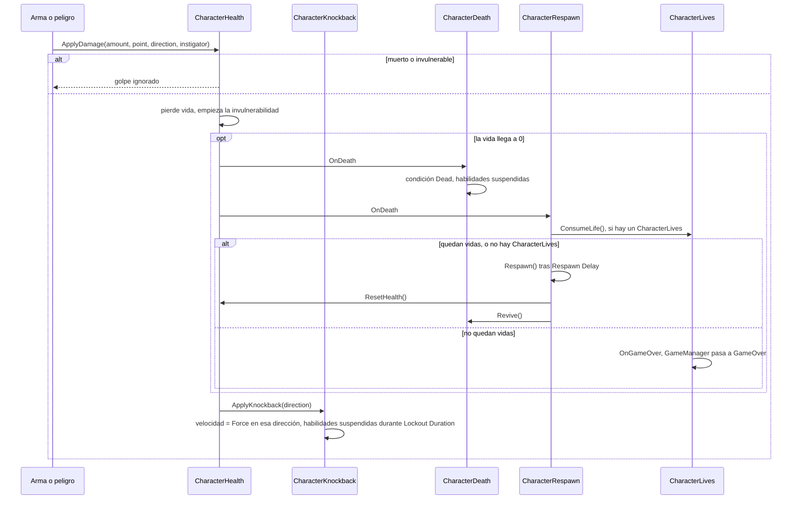

# Vida y daño

Esta guía sigue un golpe desde el momento en que un arma toca a un personaje hasta que el personaje
vuelve a estar de pie — o se acaba la partida. Cada paso es un componente aparte, así que puedes
quedarte con los que necesites: a un barril le basta la vida, un enemigo quizá agregue knockback, y
el jugador normalmente recibe la cadena completa.

## El recorrido



Las armas, [HazardZone](../components/environment/HazardZone.md) y
[EnemyMeleeOnContact](../components/ai/EnemyMeleeOnContact.md) llaman a `ApplyDamage` a través de la
interfaz `IDamageable`. El daño por caída y la muerte por vacío llaman en cambio a `TakeDamage`, que
aplica el daño pero **sin knockback**.

## CharacterHealth

[CharacterHealth](../components/health/CharacterHealth.md) guarda **Max Health** (`100`) y
`CurrentHealth`. No necesita `CharacterCore`, así que también funciona en enemigos y objetos
simples.

- `TakeDamage(amount)`, `Heal(amount)`, `ResetHealth()` (revive con la vida completa) y
  `GrantInvulnerability(seconds)`.
- `IsDead`, `IsInvulnerable`, `CurrentHealth`, `MaxHealth`.
- Eventos de C#: `OnHealthChanged(current, max)`, `OnDamaged(amount)`, `OnHealed(amount)` y
  `OnDeath`.

### Invulnerabilidad

Después de cada golpe que entra, el personaje ignora el daño durante **Invulnerability Duration**
(`0.5` s). Los golpes dentro de esa ventana se descartan, no se encolan. Otros sistemas pueden dar
tiempo extra: [PlayerRollDodge](../components/movement/PlayerRollDodge.md) hace al personaje
invulnerable durante todo el rodamiento. `GrantInvulnerability` nunca acorta una ventana más larga
que ya esté corriendo.

## Knockback y aturdimiento

<figure class="gk-clip" markdown="0"><video src="../../../assets/clips/CharacterKnockback.mp4" poster="../../../assets/clips/CharacterKnockback.jpg" autoplay loop muted playsinline preload="metadata"></video><figcaption>El personaje sale empujado lejos del golpe y pierde el control por un momento.</figcaption></figure>

Con [CharacterKnockback](../components/health/CharacterKnockback.md) en el mismo objeto, cada
`ApplyDamage` con dirección también empuja al personaje: su velocidad se reemplaza por **Force**
(`8` u/s) en la dirección del golpe, inclinada hacia arriba según **Upward Lift** (`0.35`). Todos los
golpes empujan igual, sin importar la cantidad de daño ni la masa del Rigidbody2D, así que ajusta
**Force** para cambiar qué tan lejos salen volando los personajes. Para un empujón puntual más fuerte,
llama tú a `ApplyKnockback(direction, speed)`. Durante **Lockout Duration** (`0.2` s) todas las
habilidades quedan suspendidas para que el input del jugador no anule el empujón.

[CharacterStun](../components/health/CharacterStun.md) suspende las habilidades y pone la condición
en *Stunned* durante **Default Stun Duration** (`1` s). Nada en el kit aturde automáticamente — tú
decides cuándo. Por ejemplo, aturdir con los golpes fuertes:

```csharp
using GameplayKit.Health;
using UnityEngine;

[RequireComponent(typeof(CharacterHealth), typeof(CharacterStun))]
public class StunOnHeavyHits : MonoBehaviour
{
    [SerializeField] private float threshold = 25f;

    private CharacterHealth _health;
    private CharacterStun _stun;

    private void Awake()
    {
        _health = GetComponent<CharacterHealth>();
        _stun = GetComponent<CharacterStun>();
    }

    private void OnEnable() => _health.OnDamaged += HandleDamaged;
    private void OnDisable() => _health.OnDamaged -= HandleDamaged;

    private void HandleDamaged(float amount)
    {
        if (amount >= threshold && !_health.IsDead) _stun.Stun();
    }
}
```

## Muerte, respawn y vidas

<figure class="gk-clip" markdown="0"><video src="../../../assets/clips/CharacterRespawn.mp4" poster="../../../assets/clips/CharacterRespawn.jpg" autoplay loop muted playsinline preload="metadata"></video><figcaption>Después de morir, el personaje reaparece en el último checkpoint con la vida completa.</figcaption></figure>

[CharacterDeath](../components/health/CharacterDeath.md) reacciona a `OnDeath`: pone la condición en
*Dead*, suspende las habilidades, dispara el **Death Animator Trigger** (`Die`) en un `Animator` de
los hijos si hay uno, y lanza `OnCharacterDeath`. **Disable Delay** puede desactivar el objeto
después de morir; el valor por defecto `-1` lo deja activo, que es lo que quieres para un jugador
que reaparece.

[CharacterRespawn](../components/health/CharacterRespawn.md) lo trae de vuelta después de **Respawn
Delay** (`1` s) cuando **Auto Respawn On Death** está activado: mueve al personaje al checkpoint
actual (o a **Initial Checkpoint**, o a donde empezó), borra su velocidad, restaura la vida
completa, lo revive y reinicia todas las habilidades, y luego lanza `OnRespawn`. Un trigger
[Checkpoint](../components/environment/Checkpoint.md) llama a `SetCheckpoint` cuando el jugador lo
toca. También puedes llamar a `Respawn()` tú mismo.

[CharacterLives](../components/health/CharacterLives.md) agrega un contador de vidas (**Starting
Lives** `3`, **Max Lives** `9`). Cada muerte consume una vida; cuando el contador llega a 0, el
personaje no reaparece, se dispara `OnGameOver` y, si hay un
[GameManager](../components/managers/GameManager.md), su estado pasa a `GameOver`.

!!! warning "Las vidas incluyen la actual"
    Con **Starting Lives** en `3`, el personaje reaparece después de la primera y la segunda muerte,
    y la tercera muerte es game over — como el contador de vidas de un arcade clásico.

El kit no trae una pantalla de game over ni una UI de contador de vidas. Las dos son unas pocas
líneas:

```csharp
using GameplayKit.Health;
using UnityEngine;
using UnityEngine.UI;

public class LivesHud : MonoBehaviour
{
    [SerializeField] private CharacterLives lives;
    [SerializeField] private Text livesText;
    [SerializeField] private GameObject gameOverPanel;

    private void OnEnable()
    {
        lives.OnLivesChanged += HandleLivesChanged;
        lives.OnGameOver += HandleGameOver;
    }

    private void OnDisable()
    {
        lives.OnLivesChanged -= HandleLivesChanged;
        lives.OnGameOver -= HandleGameOver;
    }

    private void Start() => HandleLivesChanged(lives.Lives);

    private void HandleLivesChanged(int count) => livesText.text = $"x{count}";
    private void HandleGameOver() => gameOverPanel.SetActive(true);
}
```

## IHealthSource y feedback visual

`IHealthSource` es el lado de solo lectura de la vida: `CurrentHealth`, `MaxHealth` y los eventos
`Damaged` / `Healed`. `CharacterHealth` y [DamageableObject](../components/combat/DamageableObject.md)
lo implementan, y los componentes de feedback solo dependen de él — así que funcionan igual en
jugadores, enemigos y objetos:

- [DamageFlash](../components/health/DamageFlash.md) tiñe cada `SpriteRenderer` del objeto con
  **Flash Color** durante **Flash Duration** (`0.1` s) en cada golpe. Con un `CharacterHealth`,
  además hace parpadear los sprites mientras el personaje es invulnerable (**Blink While
  Invulnerable**, cada **Blink Interval** de `0.08` s).
- [DamagePopupSpawner](../components/ui/DamagePopupSpawner.md) muestra números flotantes de daño y
  curación.
- [AIDecisionHealthThreshold](../components/ai/AIDecisionHealthThreshold.md) permite que un cerebro
  de IA reaccione cuando le queda poca vida.

<figure class="gk-clip" markdown="0"><video src="../../../assets/clips/DamageFlash.mp4" poster="../../../assets/clips/DamageFlash.jpg" autoplay loop muted playsinline preload="metadata"></video><figcaption>Un destello rojo con el golpe y luego parpadeo mientras es invulnerable.</figcaption></figure>

## Caer al vacío

Tres herramientas cubren las caídas, y puedes combinarlas:

- **[LevelManager](../components/managers/LevelManager.md)** con **Kill Below Void** activado:
  cualquier `CharacterHealth` activo por debajo de **Void Y** (`-30`) recibe daño letal, y luego
  muere y reaparece como en cualquier otra muerte. Lo sigue intentando cada frame, así que un
  personaje que todavía era invulnerable muere apenas termina la ventana. También afecta a los
  enemigos con `CharacterHealth`. *Create Managers* no agrega un LevelManager; agrégalo tú a tu
  objeto de managers.
- **Una zona de muerte**: un trigger ancho debajo del nivel con un
  [HazardZone](../components/environment/HazardZone.md) y un **Damage** enorme — la escena demo usa
  una con `9999`. A diferencia de la línea de vacío, golpea a cualquier `IDamageable`.
- **[CharacterFallDamage](../components/health/CharacterFallDamage.md)** para caídas largas que no
  matan de una: el daño empieza pasada la **Min Fall Distance** (`5` unidades), a razón de **Damage
  Per Unit** (`4`), hasta **Max Damage** (`60`).

## Barra de vida en el HUD

[UIHealthBar](../components/ui/UIHealthBar.md) controla una `Image` en modo *Filled* (**Fill
Image**) o un `Slider` (de 0 a 1) a partir de `OnHealthChanged`. Deja **Health** vacío y usa el
objeto con tag `Player`, y vuelve a encontrar al jugador si ese objeto se reemplaza.
**GameplayKit → Create HUD** crea una ya conectada, arriba a la izquierda del canvas.

## Siguientes pasos

- [Combate](combat.md) — las armas que inician el recorrido.
- [Construir un nivel](building-a-level.md) — checkpoints, peligros y pickups de vida.
