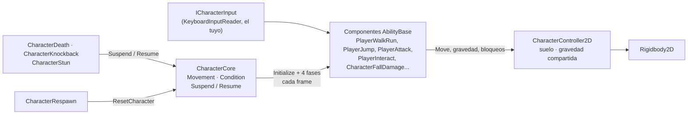
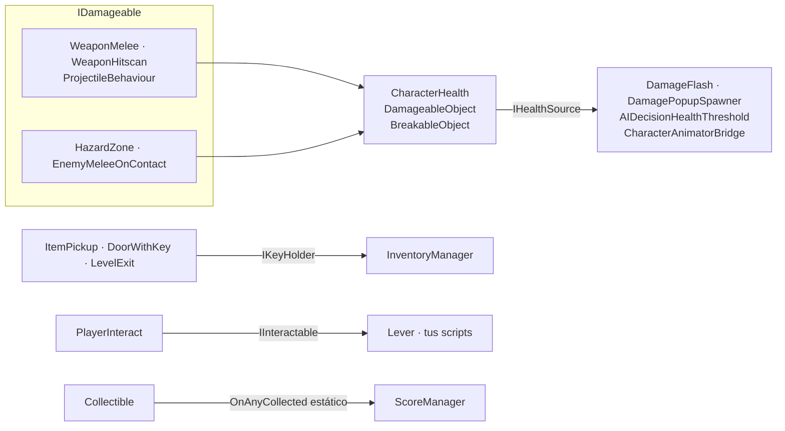

# Arquitectura

## Estructura del paquete

```text
com.alejocastellanos.gameplaykit/
├─ package.json            Unity 6000.0+, depende de los módulos AI, Physics 2D y UI + uGUI
├─ Runtime/                assembly GameplayKit.Runtime
│  ├─ Core/                GameplayKit.Core
│  ├─ Movement/            GameplayKit.Movement
│  ├─ Health/              GameplayKit.Health
│  ├─ Combat/              GameplayKit.Combat
│  ├─ AI/                  GameplayKit.AI
│  ├─ Environment/         GameplayKit.Environment
│  ├─ CameraSystem/        GameplayKit.CameraSystem
│  ├─ Managers/            GameplayKit.Managers
│  ├─ UI/                  GameplayKit.UI
│  └─ Art/                 GameplayKitSquare.png (el sprite provisorio que usan los constructores del menú)
├─ Editor/                 assembly GameplayKit.Editor: el menú GameplayKit (GameplayKitMenu.cs)
└─ Tests/
   ├─ Editor/              assembly GameplayKit.Tests.Editor: pruebas del catálogo de componentes
   └─ Runtime/             assembly GameplayKit.Tests.Runtime: pruebas de juego en play mode + helpers TestWorld
```

Cada carpeta de `Runtime/` es un namespace y una categoría de la documentación. Cada componente está en su
propio archivo, con el nombre de la clase.

**Assemblies.** Todo el código de runtime es un único assembly, `GameplayKit.Runtime` (namespace raíz
`GameplayKit`). Referencia `Unity.InputSystem` y define `GAMEPLAYKIT_INPUT_SYSTEM` con un version define cuando
está instalado el paquete `com.unity.inputsystem` (1.0.0 o superior), así que el Input System es opcional. Los
assemblies de pruebas solo compilan con `UNITY_INCLUDE_TESTS`, que se define cuando el paquete está en
`testables`.

## El núcleo del personaje



- **`CharacterCore`** tiene dos máquinas de estados (`Movement`, `Condition`), descubre en `Awake` todas las
  `AbilityBase` del objeto y sus hijos, y las ejecuta en cuatro fases en cada `Update`: `HandleInput`,
  `EarlyProcessAbility`, `ProcessAbility`, `LateProcessAbility`, saltándose las que están desmarcadas o con
  `AbilityEnabled = false`. Una habilidad que lanza una excepción se desactiva sola. Ver [Habilidades propias](../guides/custom-abilities.md#como-ejecuta-charactercore-las-habilidades).
- **`CharacterController2D`** envuelve al `Rigidbody2D`: detección de suelo, ayudas de velocidad, gravedad
  compartida (`OverrideGravity`/`ReleaseGravity`), bloqueo temporal del control horizontal y bloqueo del
  salto por un frame.
- **`ICharacterInput`** es la única forma en que las habilidades leen el input. `KeyboardInputReader` es la
  implementación por defecto (teclado, mouse y gamepad a través de `InputCompat`); las pruebas usan
  `ScriptedCharacterInput`, y puedes conectar IA o replays.
- Los componentes de vida *no* son habilidades: `CharacterHealth` funciona en cualquier objeto, y los que
  reaccionan a él (`CharacterDeath`, `CharacterKnockback`, `CharacterStun`) hablan con el core mediante
  `Suspend`/`Resume` y el estado `Condition` cuando hay un core.

## Cómo se comunican las categorías

Las categorías no dependen de las clases concretas de otras para sus interacciones principales. Se encuentran
a través de cuatro interfaces pequeñas de `GameplayKit.Core`, un evento estático y algunos singletons
opcionales:



| Contrato | Lo implementan | Lo usan |
|---|---|---|
| `IDamageable` | `CharacterHealth`, `DamageableObject`, `BreakableObject` | `WeaponMelee`, `WeaponHitscan`, `ProjectileBehaviour`, `HazardZone`, `EnemyMeleeOnContact`, `CharacterAimAndOrient` (para encontrar objetivos) |
| `IHealthSource` | `CharacterHealth`, `DamageableObject` | `DamageFlash`, `DamagePopupSpawner`, `AIDecisionHealthThreshold`, `CharacterAnimatorBridge` |
| `IKeyHolder` | `InventoryManager` | `ItemPickup`, `DoorWithKey`, `LevelExit` |
| `IInteractable` | `Lever` | `PlayerInteract` |
| `Collectible.OnAnyCollected` (evento estático) | `Collectible` | `ScoreManager` |

Los demás vínculos directos son búsquedas opcionales; todas revisan `null` y funcionan sin la otra parte:

| Desde | Hacia | Para qué |
|---|---|---|
| `Checkpoint` | `CharacterRespawn`, `LevelManager.Instance` | Guardar el punto de reaparición. |
| `CameraBounds` | `LevelManager.Instance` | Usar los límites del nivel si la cámara no tiene los suyos. |
| `LevelManager` | `CharacterHealth.Active` | Matar a los personajes que caen al vacío. |
| `CharacterLives` | `GameManager.Instance` | Pasar a `GameOver`. |
| `PauseManager` | `GameManager.Instance` | Alternar entre `Playing` y `Paused` (sin pisar `GameOver`). |
| `LevelExit` | `SceneTransitionManager.Instance` | Fundido al cargar. |
| `UIScoreText`, `UIPauseMenu` | `ScoreManager.Instance`, `PauseManager.Instance` | Mostrar el puntaje, mostrar/ocultar el menú. |
| `UIHealthBar` | `CharacterHealth` | Barra de vida. |
| `PlayerSwim` | `WaterZone` | Reconocer el agua sin tag. |
| `PlayerRollDodge` | `CharacterHealth` | Invulnerabilidad durante la rodada. |
| `AIActionShoot`, `EnemyShootOnSight`, `PlayerAttack` | Armas de combate | Disparar el arma del mismo objeto. |

En cuanto a namespaces: `Core` no depende de nada más del kit; `Combat` usa `Core`; `AI` usa `Core` y
`Combat`; `CameraSystem` solo busca el `LevelManager`; `Movement`, `Health`, `Environment`, `Managers` y `UI`
usan `Core` más los vínculos opcionales de arriba.

## Principios de diseño

### Valores por defecto que funcionan solos

Un componente debería hacer algo razonable apenas se agrega, con todas sus referencias opcionales:

- `CharacterCore` agrega un `KeyboardInputReader` cuando no hay fuente de input.
- `CharacterController2D` encuentra el suelo a partir de los límites del collider (sin objeto de ground
  check), congela la rotación del cuerpo y le pone al collider un material sin fricción para que los
  personajes no se peguen a las paredes.
- Cámaras, barras de vida, spawners, zoom y los comportamientos de enemigo independientes (`EnemyChase`,
  `EnemyFlee`, `EnemyShootOnSight`, con [PlayerLocator](core-api.md#playerlocator)) buscan el objeto con tag
  `Player` cuando su objetivo está vacío.
- Los managers persistentes pueden estar bajo cualquier padre: se mueven solos a la raíz de la escena antes de
  `DontDestroyOnLoad`.
- `AudioManager` crea sus fuentes de audio y `SceneTransitionManager` su capa de fundido.
- Waypoints y límites pueden ser hijos del objeto que los usa: sus posiciones de mundo se copian al iniciar
  (`MovingPlatform`, `Elevator`, `EnemyPatrolWithinBounds`, `AIActionPatrolPoints`), así no se mueven con él.
- `PlayerCrouch` lee el tamaño de pie del collider al iniciar; `OneWayPlatform` agrega su propio collider y
  effector.

### Capas en *Everything* y consultas que se ignoran a sí mismas

Los chequeos de suelo, pared, borde y visión suelen empezar *dentro* del collider de quien pregunta. Con
llamadas directas a `Physics2D` ese collider se detecta a sí mismo, y el parche habitual es una capa "Player"
excluida de todas las máscaras. En cambio, el kit hace esos chequeos con
[PhysicsQuery2D](core-api.md#physicsquery2d), cuyo `Raycast` y `OverlapCircle` saltan los colliders que
pertenecen a quien pregunta (él mismo, sus hijos o cualquier cosa en su Rigidbody2D) y también los triggers
salvo que se pidan. Por eso todas las máscaras de capas pueden venir en *Everything*.

### Tags tolerantes

`CompareTag` lanza un error si el tag no existe en el Tag Manager, lo que rompería un componente recién
agregado en un proyecto que nunca creó ese tag. [TagFilter](core-api.md#tagfilter) compara tags de forma
segura, y además acepta el tag del Rigidbody2D de un collider, así los colliders en objetos hijos cuentan como
el jugador. Los tags opcionales (`Ladder`, `Water`, `RopeAnchor`) tienen componentes marcadores como
alternativa.

### Cuerpos dormidos en zonas y plataformas

Unity deja de enviar `OnTriggerStay2D` cuando un `Rigidbody2D` se duerme, cosa que pasa cuando el jugador se
queda quieto: una zona de pinchos basada en `Stay` dejaría de dañar a un jugador que no se mueve. Las zonas que
actúan "mientras estés adentro" (`HazardZone`, `HealthPickup`, `WindZone2D`, `WaterZone`) registran a los
ocupantes con Enter/Exit en `TriggerOccupants` y aplican su efecto desde `Update`/`FixedUpdate`, contando
colliders por ocupante para que un personaje con varios colliders no "salga" antes de tiempo. Las plataformas
móviles, ascensores y cintas llevan a sus pasajeros con `PlatformRiders`, que desplaza a cada pasajero lo mismo
que la plataforma y lo despierta (emparentar no funciona con cuerpos dinámicos).

### Estado compartido con dueño

Lo que varios sistemas quieren cambiar a la vez tiene una API con dueño en lugar de un setter simple:
anulaciones de gravedad (`OverrideGravity(owner, scale)`, gana la última), suspensión de habilidades
(`Suspend(source)`), el bloqueo del control horizontal (solo se alarga) y el bloqueo del salto (un frame).

### Aislamiento de fallas

Una habilidad que lanza una excepción se desactiva una vez, con un mensaje claro en la consola, en lugar de
cortar el ciclo para todas las habilidades que vienen después y repetir el error cada frame.

### Nunca cargar escenas por sorpresa

Solo `LevelExit`, `SceneTransitionManager` y los botones del menú de pausa cargan escenas, y solo cuando se les
pide. Por eso la meta de la escena demo es un coleccionable.
